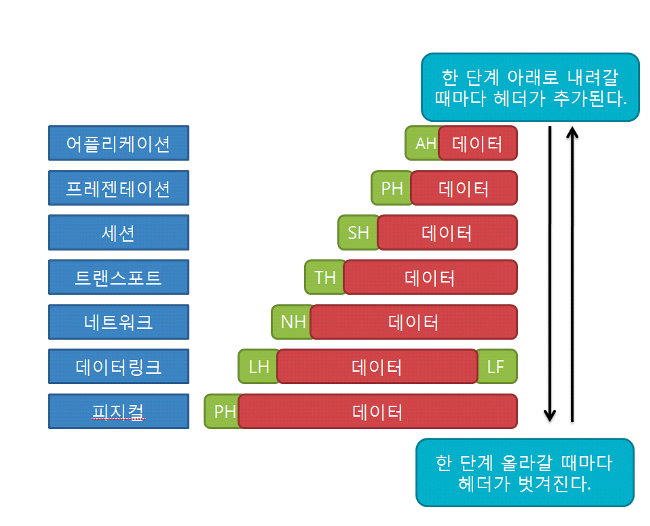

# OSI 7계층

## OSI 7계층이란?

네트워크에서 통신이 일어나는 그 일련의 과정들을 7단계로 나눈 것이다

물데네전세표응

- 물리
- 데이터 링크
- 네트워크
- 전송
- 세션
- 표현
- 응용

## OSI 7계층 동작 원리

# OSI 7계층, 계층별 특징

## 1계층 : 물리 계층(Physical Layer)

- **전기적 신호**가 나가는 **물리적인 장비**를 의미한다.
- 단지 데이터를 전달할뿐, 어떤 에러가 있는지 등에 대해서는 신경쓰지 않는다.
- 단지 데이터를 전지적인 신호로 변환해서 주고받는 기능에 신경쓴다.
- 장비 : 리피터, 허브
- 프로토콜 데이터 단위 : **비트** (Bit)

## 2계층 : 데이터 링크 계층(Data link layer)

- 물리계층을 통해 송수신되는 **정보의 오류와 흐름을 관리**한다
- 통신에서의 오류도 찾아주고 재전송도 하는 기능
- 프레임 동기화
- 맥 주소를 가지고 통신하게 된다.데이터 링크 계층은 신뢰성 있는 전송을 보장하기 위한 계층으로 CRC기반의 오류 제어와 흐름 제어가 필요하다.
    - 흐름 제어 : 송신 측과 수신 측의 속도 차이를 조정
    - 오류 제어 : 오류 검출과 회복
    - 순서 제어 : 프레임의 순서적 전송
- 장비 : 랜카드, 브리지, 스위치
- 프로토콜 데이터 단위 : **프레임** (Frame)

## 3계층 : 네트워크 계층(Network layer)

- **경로(Route)와 주소(IP)를 정하고** 데이터를 **패킷** 단위로 쪼개어 전송
- 장비 : **라우터**
- 프로토콜 데이터 단위 : 패킷

## 4계층 : 전송 계층(Transport layer)

- 사용자들 간(End to End) 신뢰성있는 데이터를 주고 받게 해주는 역할을 한다
- 오류검출 및 복구, 흐름제어와 중복검사 등을 수행데이터 전송을 위해서 **Port 번호**가 사용이 된다
- **TCP와 UD**
- 장비 : 게이트웨이
- 프로토콜 데이터 단위 : **세그먼트**

## 5계층 : 세션 계층(Session layer)

- 실제 네트워크 연결이 이루어짐
- 프로세스가 통싱하기 위한 방법 정의
- TCP/IP 세션을 생성 및 제거
- 프로토콜 데이터 단위 : **메시지**

## 6계층 : 표현 계층(Presentation layer)

- 응용프로그램 혹은 네트워크를 위해 **데이터를 ‘표현’**하는 계층
- 압축,암호화,복호화, 데이터 변환 등

## 7. 응용 계층(Application layer)

- 응용 서비스나 프로세스가 응용계층에서 동작
- HTTP, FTP, SMTP