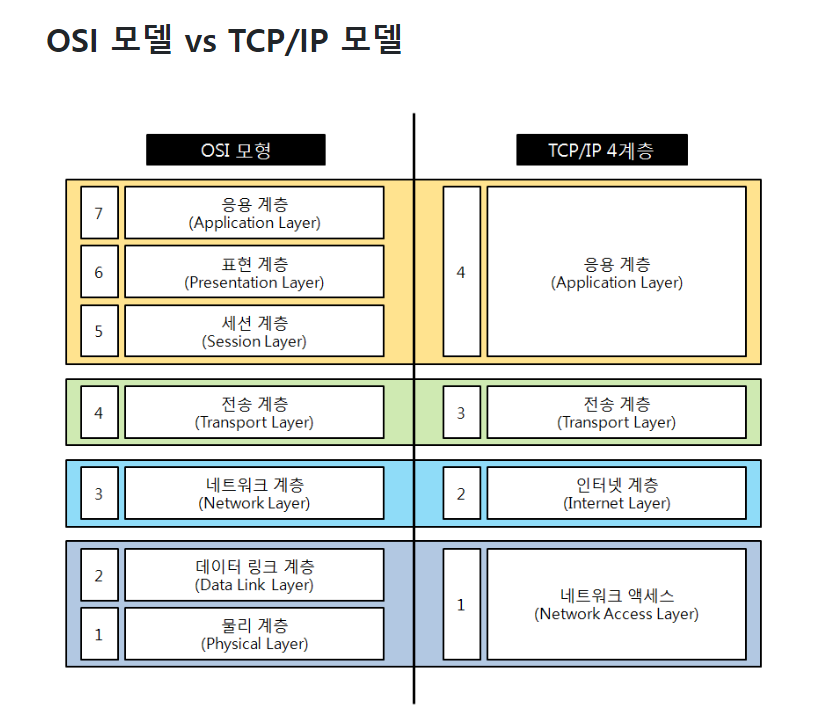

## **TCP/IP와 OSI 7 계층의 차이점**

가장 큰 차이점은 OSI는 개념적 모델로 통신에는 실질적으로 구현 되어 사용되지 않지만 TCP / IP는 연결을 설정하고 네트워크를 통해 통신하는 데 사용되는 것이다.

## **TCP/IP 4계층**

| TCP/IP 4계층 | 역할 | 데이터 단위 | 전송 주소 | 예시 | 장비 |
| --- | --- | --- | --- | --- | --- |
| 응용 계층 (Application Layer) | 응용프로그램끼리의 데이터 송수신 | Data/Message | - | 파일 전송, 이메일, FTP, HTTP, DNS, SMTP 등 | - |
| 전송 계층 (Transport Layer) | 호스트끼리 송수신 | Segment | Port | TCP, UDP 등 | 게이트웨이 |
| 인터넷 계층 (Internet Layer) | 데이터 전송을 위한 논리적 주소 및 경로 지정 | Packet | IP | IP, ARP, ICMP, RARP 등 | 라우터 |
| 네트워크 연결 계층 (Network Acees Layer) | 실제 데이터인 프레임 송수신 | Frame | MAC | Ethernet 등 | 브릿지, 스위치 |

### Application Layer

OSI 계층에서 5(세션),6(표현),7(응용) 계층에 해당한다

사용자가 응용프로그램과 소통할 수 있게 UI를 제공한다

TCP/IP 기반의 응용 프로그램을 구분할 때 사용한다

**TCP/IP 소켓 프로그래밍 (네트워크 프로그래망)**: 운영체제의 전송 계층에서 제공하는 API를 활용해서 통신 가능한 프로그램을 만드는 것

### Transport Layer

OSI 계층에서 4(전송) 계층에 해당한다

데이터의 송수신을 담당하고, 통신 노드 간의 연결을 제어한다

네트워크 양단의 송수신 호스트 사이에서 신뢰성 있는 전송 기능을 제공한다

대표적인 프로토콜은 `TCP`와 `UDP`가 있다

### Internet Layer

- OSI 7계층의 네트워크 계층에 해당한다.
- 논리적 주소인 IP를 이용한 노드간 데이터 전송과 라우팅 기능을 담당한다.

### Network Access Layer

OSI 계층의 1,2계층에 해당한다

운영체제의 하드웨어적인 요소와 관련된 모든 것을 지원하는 계층이다

물리적으로 데이터가 네트워크를 통해 어떻게 전송되는지 정의한다

에러 검출 기능과 패킷의 프레임화 기능을 담당한다

## TCP

연결 지향적 프로토콜이다(클라이언트와 서버가 연결된 상태에서 데이터를 주고받음)

안정적으로, 순서대로, 에러 없이, 누락 없이 교환할 수 있게 해주는 프로토콜

### TCP의 특징

- 연결형 서비스
    - 3way handshake, 4way handshake를 통해 연결을 설정하고 해제한다
- 흐름 제어
    - 데이터의 처리 속도를 조절해서 오버플로우를 방지한다
- 혼잡 제어
    - 네트워크의 패킷 수를 조절한다
- 높은 신뢰성 보장
    - 대신에 느리다
- 전이중, 점대점
    - 전이중(Full-Duplex) : 전송이 양방향으로 동시에 일어날 수 있다.
    - 점대점(Point to Point) : 각 연결이 정확히 2개의 종단점을 가지고 있다.

## UDP

UDP는 신뢰성보다는 연속성 있는 전송이 필요할 때 사용하는 프로토콜로

실시간 서비스(streaming)에 자주 사용된다

### UDP의 특징

- 비연결형 서비스로 데이터그램 방식을 제공한다
    - 데이터의 전송 순서가 바뀔 수 있다
- 데이터 수신 여부를 확인하지 않는다
    - 3 way handshake와 같은 과정이 없다
- 신뢰성이 낮다
    - 흐름제어가 없어서 제대로 전송 되었는지, 오류가 없는지 확인할 수 없다
- TCP보다 속도가 빠르다
    - 1:1 & 1:N & N:N 통신이 가능하다

## 흐름제어

수신측에서 제한된 저장 용량을 초과한 이후에 도착하는 데이터는 손실 될 수 있으며, 만약 손실 된다면 불필요하게 응답과 데이터 전송이 송/수신 측 간에 빈번히 발생한다

## 혼잡 제어

송신측의 데이터는 지역망이나 인터넷으로 연결된 대형 네트워크를 통해 전달된다

만약 한 라우터에 데이터가 몰릴 경우, 자신에게 온 데이터를 모두 처리할 수 없게 된다

이런 경우 호스트들은 또 다시 재전송을 하게되고 결국 혼잡만 가중시켜 오버플로우나 데이터 손신을 발생시키게 된다.

따라서 이러한 네트워크의 혼잡을 피하기 우해 송신측에서 보내는 데이터의 전송속도를 강제로 줄이게 되는데, 이러한 작업을 혼잡제어라고 한다.