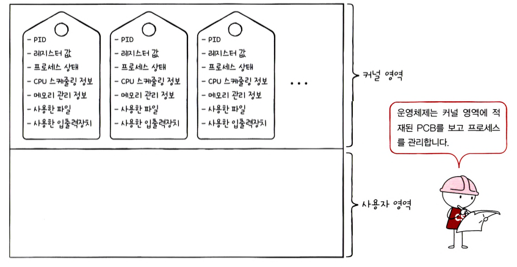
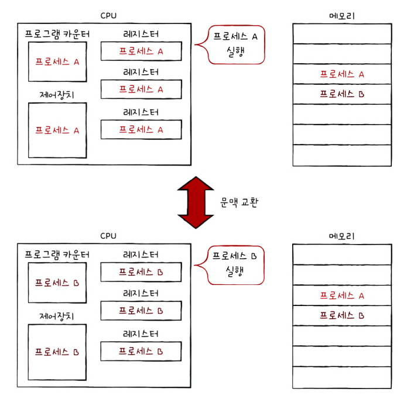
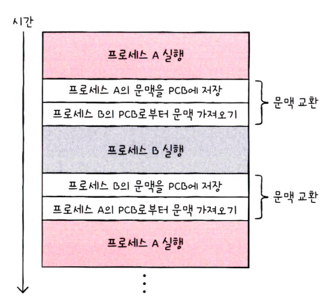
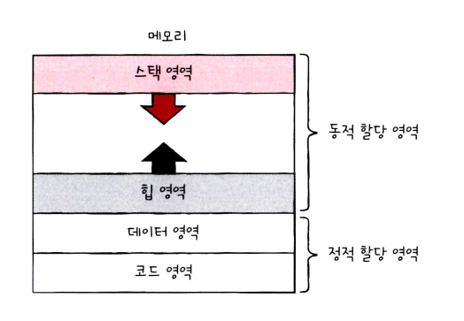
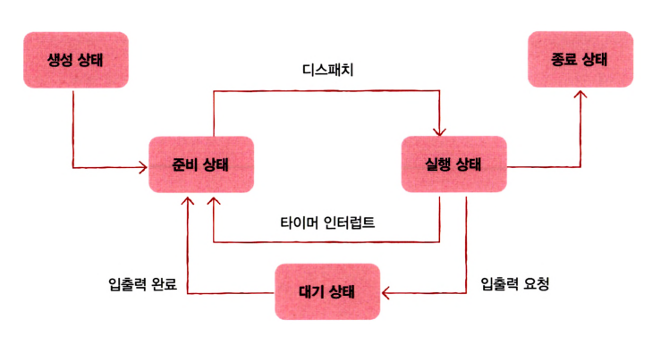

# 10단원 프로세스와 스레드

# 프로세스 개요

### 프로세스

**프로세스** : 실행 중인 프로그램. 실행되기 전까지 프로그램은 보조기억장치에 있는 데이터 덩어리일 뿐이지만, 보조기억장치에 저장된 프로그램을 메모리에 적재하고 실행하는 순간 프로세스가 된다

**포그라운드 프로세스** : 사용자가 보는 앞에서 실행

**백그라운드 프로세스** : 사용자가 보지 못하는 뒤편에서 실행

**데몬/서비스** : 사용자와 상호작용하기 않고 정해진 일만 수행하는 백그라운드 프로세스(운영체제 : 데몬, 윈도우 운영체제 : 서비스 ex) 작업관리자 → 서비스)

**프로세스 제어 블록(Process Control Block, PCB)** : 프로세스와 관련된 정보를 저장하는 자료 구조

- PCB는 **커널 영역**에 생성된다
- PCB는 프로세스 생성 시에 만들어지고 끝나면 폐기된다

**PCB에 저장되는 정보**

- **프로세스ID(PID)** : 특정 프로세스를 식별하기 위한 고유 번호
- **레지스터 값** : 이전까지 사용했던 레지스터의 중간값들을 저장, 프로그램 카운터(PC)
- **상태** : 현재 프로세스의 상태(Ready, Running, Blocked 등)
- **CPU 스케줄링 정보** : 언제 어떤 순서로 CPU를 할당 받을지에 대한 정보
- **메모리 정보** : 메모리에 저장된 위치. 베이스 레지스터, 한계 레지스터, 페이지 테이블 정보
- **사용한 파일과 입출력장치 목록** : 어떤 파일을 열었는지, 어떤 장치가 할당되었는지



### 문맥 교환(Context Switching)

**문맥(Context)** : 프로세스 수행을 재개하기 위해 기억해야할 정보

ex) 프로그램 카운터를 비롯한 각종 레지스터 값, 메모리 정보, 실행을 위해 열었던 파일이나 사용한 입출력장치 등

**문맥 교환(Context Switching)** : 하나의 프로세스에서 다른 프로세스로 실행 순서가 넘어가면 바로 직전까지 실행되던 프로세스 A는 **문맥**을 **PCB**에 백업한다(CPU 양보, 인터럽트 발생 등). 이후 새로운 프로세스를 실행하기 위한 **문맥**을 **PCB**로부터 복구하여 새로운 프로세스를 실행하는 작업





### 프로세스의 메모리 영역

프로세스가 생성되면 커널 영역에는 PCB가 생성된다. 하나의 프로세스는 **사용자 영역**에 **코드 영역, 데이터 영역, 힙 영역, 스택 영역**으로 나누어 저장된다.



### 코드 영역(Code Segment, 텍스트영역, Text Segment)

- 실행할 수 있는 명령어 코드가 기계어로 저장된다
- 읽기 전용(read-only)공간이기 때문에 쓰기가 금지
- **정적 할당 영역**(크기가 고정된 영역, 크기가 변할 리 없고 프로그램 실행 동안 유지될 데이터)

### 데이터 영역(Data Segment)

- 잠깐 썼다가 없앨 데이터가 아닌 프로그램이 실행되는 동안 유지할 데이터가 저장
    - ex)전역 변수
- 정적 할당 영역

### 힙 영역(Heap Segment)

- 프로그래머가 직접 할당할 수 있는 저장 공간
- 할당한 공간은 반환해야한다
    - 반환하지 않으면 **메모리 누수**(memory leak) 발생
- 동적 할당 영역 : 실시간으로 크기가 변할 수 있는 영역
- 낮은 주소에서 높은 주소로 할당

### 스택 영역

- 데이터를 일시적으로 저장하는 공간
    - ex) 매개 변수, 지역 변수
- 일시적으로 저장할 데이터는 스택 영역에 PUSH 되고 필요하지 않는 데이터는 POP된다
- 동적 할당 영역 : 실시간으로 크기가 변할 수 있는 영역
- 높은 주소에서 낮은 주소로 할당

```jsx
Q : 스택 영역과 힙 영역이 새롭게 할당나다가 충돌나면?
A : 메모리 크기 제한: 운영체제는 프로세스마다 사용할 수 있는 최대 메모리 크기를 제한합니다.
    이 제한을 초과하려고 하면 프로그램이 비정상 종료됩니다. 
    스택 오버플로우가 발생하면 일반적으로 스택 크기 초과(stack overflow) 예외가 발생 
    힙 메모리가 부족하면 메모리 부족(out of memory) 오류가 발생합니다.
```

# 프로세스 상태와 계층 구조

### 프로세스 상태

여러 프로세스들이 빠르게 번갈아 가면서 실행되며 동시에 실행되는 것 처럼 보인다. 그 과정에서 하나의 프로세스는 여러 상태를 거친다. 이 상태는 PCB에 의해 관리된다

### 생성 상태(new)

프로세스를 생성 중인 상태

생성 상태를 거쳐 실행할 준비가 완료된 프로세스는 바로 실행되지 않고 **준비 상태**가 되어 CPU 할당을 기다린다

### 준비 상태(ready)

당장이라도 CPU를 할당받아 실행할 수 있는 상태. CPU를 할당받아 실행 상태가 되길 기다린다

### 실행 상태(running)

CPU를 할당받아 실행 중인 상태

살당된 일정 시간 동안만 CPU를 사용할 수 있다

할당된 시간을 모두 사용하여 **타이머 인터럽트**가 발생하면 다시 **준비 상태**가 된다

실행 도중 입출력 장치를 사용하면 입출력 장치의 작업이 끝날 때 까지 **대기 상태**가 된다

### 대기 상태(blocked)

프로세스는 실행 도중 입출력장치를 사용하는 경우가 있다

입출력 작업 뿐만 아니라 특정 이벤트가 일어나길 기다릴 때 대기 상태가 된다. 다만 대부분의 원인이 입출력 작업이다

입출력 작업은 CPU에 비해 처리 속도가 느리다

입출력 작업을 요청한 프로세스는 입출력이 끝나고 **입출력 완료 인터럽트**가 발생를 받을 때까지 기다린다

대기 상태가 종료되면 **준비 상태**가 된다

### 종료 상태(terminated)

프로세스가 종료된 상태

PCB와 사용한 메모리를 정리한

### 프로세스 다이어그램



### 프로세스 계층 구조

프로세스는 실행 도중 시스템 호출을 통해 다른 프로세스를 생성할 수 있다

**부모 프로세스(Parent Process)** : 새 프로세스를 생성한 프로세스

**자식 프로세스(Childe Process)** : 부모 프로세스에 의해 생성된 프로세스

부모와 자식 프로세스는 각기 다른 **PID**를 갖는다(서로 다른 프로세스다)

자식 프로세스의 PCB에 **부모 프로세스의 PID(PPID)**가 기록되기도 한다

자식 프로세스도 새로운 자식 프로세스를 생성할 수 있다

**프로세스 계층 구조** :  컴퓨터가 부팅될 때 실행되는 최초의 프로세스가 자식 프로세스들을 생성하고, 생성된 자식 프로세스들이 새로운 프로세스들을 낳는 형식으로 여러 프로세스가 동시에 실행되는 구조

# 프로세스 생성 기법

부모 프로세스를 통해 생성된 자식 프로세스들은 복제와 옷 갈아입기를 통해 실행된다

**fork** : 부모 프로세스는 fork를 통해 자신의 복사본을 자식 프로세스로 생성한다(복사본은 PID와 저장된 메모리 위치가 다르다)

**exec** : 만들어진 복사본은 exec를 통해 자신의 메모리 공간을 다른 프로그램으로 교체한다. 즉 자신의 메모리 공간을 새로운 프로그램으로 덮어쓰는 시스템 콜

fork와 exec는 시스템 호출이다

# 스레드

**스레드** : 실행의 단위. 프로세스를 구성하는 실행의 흐름 단위

하나의 프로세스는 여러개의 스레드를 갖는다

스레드를 이용하면 하나의 프로게스에서 여러 부분을 동시에 실행할 수 있다

**단일 스레드 프로세스** : 실행의 흐름 단위가 하나인 프로세스

**멀티 스레드 프로세스** : 프로세스를 구성하는 여러 명령어를 동시에 실행한다

**스레드의 구성 요소**

프로세스의 스레드는 실행에 필요한 최소한의 정보만을 유지한 채 프로세스 자원을 공유

- 프로그램 카운터
- 레지스터 값
- 스택

# 멀티프로세스 vs 멀티스레드

단일 스레드 프로세스를 여러개 vs 하나의 프로세스를 여러 스레드로

프로세스끼리는 기본적으로 자원을 공유하지 않지만, **스레드끼리는 같은 프로세스 내의 자원을 공유한다**

스레드는 코드, 힙, 데이터 영역을 공유하지만 멀티 프로세스는 같은 프로그램을 실행하기 위해 메모리에 동일한 내용들이 중복해서 존재하기 때문에 메모리가 낭비된다. 여러 프로세스를 병행 실행하는 것보다 메모리를 더 효율적으로 사용할 수 있기 때문에 멀티 스레드 방식을 사용한다

**멀티 스레드의 단점**

프로세스의 자원을 공유하기 때문에 하나의 스레드에 문제가 생기면 프로세스 전체에 문제가 생길 수 있다

**IPC(Inter-Process Communication, 프로세스 간 통신)**

프로세스끼리는 일반적으로 자원을 공유하지 않지만 프로세스 간의 자원을 공유하고 데이터를 주고 받을 수 있다

**파일을 통한 프로세스 간 통신** : ****hello.txt를 사용하는 두 프로세스가 hello.txt에 데이터를 읽고 쓰며 데이터를 주고 받는다()

**공유 메모리** : 프로세스들은 서로 공유하는 메모리 영역을 두어 데이터를 주고 받을 수도 있다