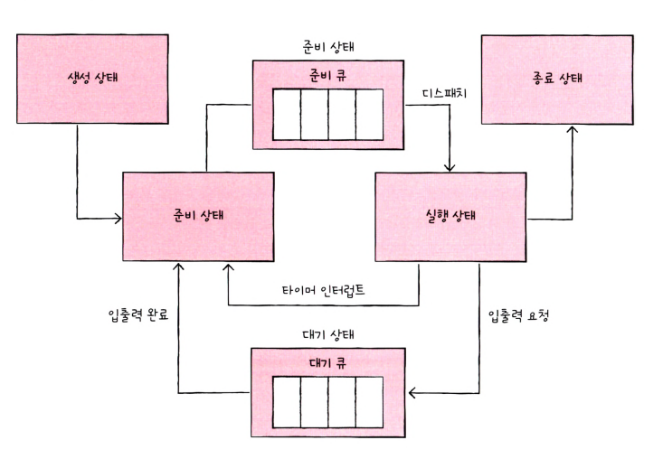

# 11단원 CPU 스케줄링

**CPU 스케줄링** : 운영체제가 프로세스들에게 공정하고 합리적으로 CPU 자원을 배분하는 것

## 프로세스 우선순위

우선순위가 높은 프로세스란 빨리 처리해야 하는 프로세스. 대표적으로 입출력 작업이 많은 프로세스

**입출력 집중 프로세스(I/O bound process)** : 실행 상태보다는 입출력을 위한 대기 상태에 많이 머무른다

**CPU 집중 프로스세(CPU bound process)** : 대기 상태보다는 실행 상태에 더 많이 머무른다

우선순위는 PCB에 명시한다

## 스케줄링 큐

운영체제로부터 자원을 할당 받위 위해 기다리는 줄

준비 큐 : CPU를 이용하고 싶은 프로세스들이 서는 줄

대기 큐 : 입출력 장치를 이용하기 위해 대기 상태에 접어든 프로세스들이 서는 줄

운영체제는 PCB들이 큐에 삽입된 순서대로 프로세스를 하나씩 꺼내어 실행하되, 그중 우선순
위가 높은 프로세스를 먼저 실행합니다.

## 선점형과 비선점형 스케줄링

**선점형 스케줄링(preemptive scheduling)** : 프로세스가 CPU를 비롯한 자원을 사용하고 있더라도 운영체제가 프로세스로부터 자원을 강제로 빼앗아 다른 프로세스에 할당할 수 있는 스케줄링 방식

**장점** : 급한 프로세스가 언제든 끼어들어 사용할 수 있으므로 어느 한 프로세스의 자원 독점을 막고 프로세스들에 골고루 자원을 배분할 수 있다

**단점** : 그만큼 문맥 교환 과정에서 오버헤드가 발생할 수 있다

**비선점형 스케줄링(non-preemptive scheduling)** : 하나의 프로세스가 자원을 사용하고 있다면 그 프로세스가 종료되거나 스스로 대기 상태에 접어들기 전까진 다른 프로세스가 끼어들 수 없는 스케줄링 방식

**장점** : 교환 횟수가 적기 때문에 문맥 교환에서 발생하는 오버헤드는 적다

**단점** : 하나의 프로세스가 자원을 사용 중이라면 당장 자원을 사용해야하는 상황에서도 기다려야한다

대부분의 OS는 선점형 방식을 사용

## CPU스케줄링 알고리즘

### **선입 선처리 스케줄링(FCFS)**

**선입 선처리 스케줄링 (FCFS first come first served , FIFO first in first out)** : 큐에 삽입된 순서대로 프로세스들을 처리하는 비선점형 스케줄링

**단점** : 프로세스들이 기다리는 시간이 매우 길어질 수 있다, **호위효과**(Convoy Effect)

**호위효과(Convoy Effect)** : CPU 사용시간이 긴 프로세스에 의해 사용시간이 짧은 프로세스들이 오래 기다리는 현상

### 최단 작업 우선 스케줄링(SJF)

**최단 작업 우선 스케줄링(SJF Shortest Job First)** : CPU 사용 시간이 짧은 프로세스를 먼저 실행한다

기본적으로는 비선점형 but 선점형으로 구현될 수 있다

### 라운드 로빈 스케줄링

**라운드 로빈 스케줄링(Robin Scheduling)** : FCFS에 타임 슬라이스 개념이 더해진 방식

**타임 슬라이스** : 각 프로세스가 CPU를 사용할 수 있는 정해진 시간

타임 슬라이스의 크기가 중요하다

### 최소 잔여 시간 우선 스케줄링(SRT)

**최소 잔여 시간 우선 스케줄링(SRT, Shortest Remaining Time)** : 최단 작업 우선 + 라운드 로빈. 정재힌 타임 슬라이스만큼 CPU를 사용하되, CPU를 사용할 다음 프로세스로는 남아있는 작업 시간이 가장 적은 프로세스가 선택된다

### 우선순위 스케줄링

**우선순위 스케줄링(Priority Scheduling)** : 가장 높은 우선순위를 가진 프로세스부터 실행하는 스케줄링 알고리즘. 우선순위가 같은 프로세스들은 FCFS

**단점** : 우선순위가 낮은 프로세스는 굶는다(기아, Starvation 현상)

기아 현상을 해결하기 위해 대표적인 해결책이 바로 에이징 기법

**에이징(Aging)** : 대기 중인 프로세스의 우선순위를 마치 나이 먹듯 점차 증가시키는 방법

### 다단계 큐 스케줄링

**다단계 큐 스케줄링(multi leveled queue scheduling)** : 우선순위별로 준비 큐를 여러개 사용한다

장프로세스 유형별로 우선순위를 구분하여 실행할 수 있다. 

또한 큐별로 타임 슬라이스를 여러 개 지정할 수도 있고, 큐마다 다른 스케줄링 알고리즘을 적용할 수 있다

한계 : 프로세스들이 큐 사이를 이동할 수 없다

### 다단계 피드백 큐 스케줄링

**다단계 피드백 큐 스케줄링(multileveled feedback queue scheduling)  :** 다단계 큐 스케줄링에서 기아 현상을 해결하기 위해 보완한 큐. 프로세스들이 큐 사이를 이동할 수 있다. 해당 큐에서 실행이 끝나지 않는다면 다음 우선순위 큐에 삽입되어 실행된다. 즉, 우선순위가 낮아진다. 하지만 낮은 우선순위 큐에서 너무 오래 대기하면 우선순위를 다시 올려준다