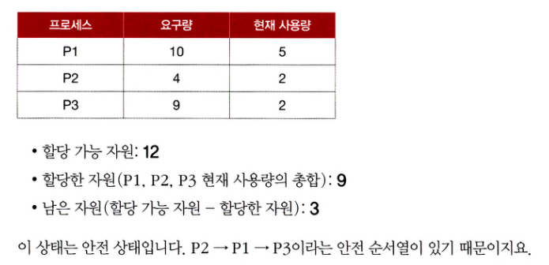
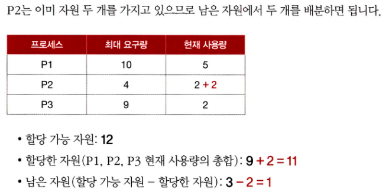
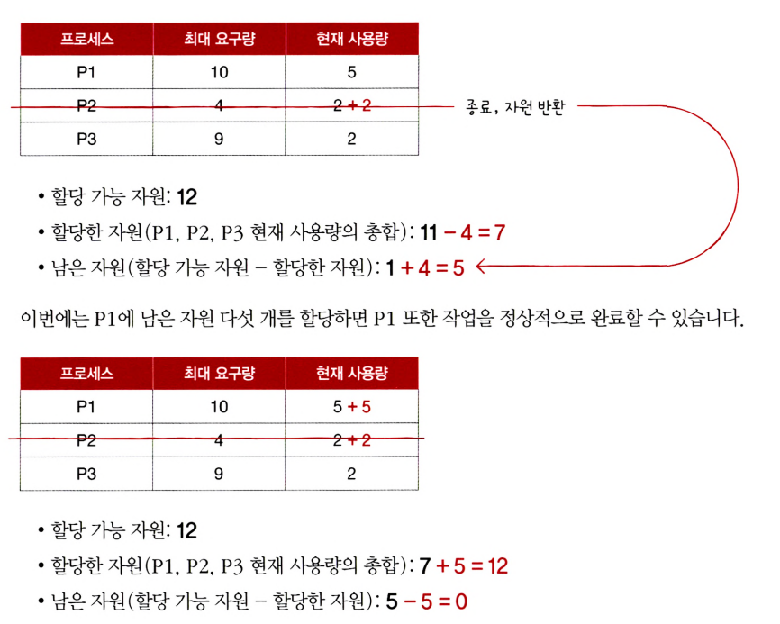
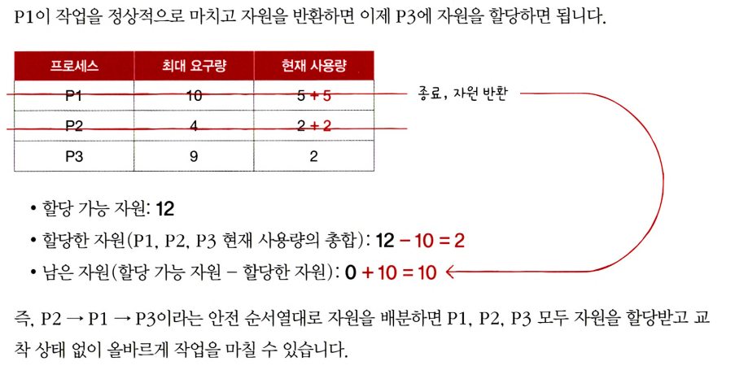

## 교착 상태

**식사하는 철학자 문제** : 고착 상태를 보여주는 예시 상황

원탁에 철학자 5명과 포크 5개가 사이사이에 놓여있다

2개의 포크를 할당 받아야 식사를 할 수 있다

양옆의 포크만 할당 받을 수 있다

식사를 하기 위해 포크를 무한 대기할 수 있음

**교착 상태** : 일어나지 않을 사건을 기다리며 진행이 멈춰 버리는 현상

프로세스들이 서로 사용하고 있는 공유 자원을 기다리는 상태. 두 프로세스 모두 무한히 대기하며 교착 상태가 발생

```jsx
lock1 = true;
while(lock2 == true);
	//임계 구역 진입
lock1 = false;
```

```jsx
lock2 = true;
while(lock1 == true);
	//임계 구역 진입
lock2 = false;
```

교착 상태를 해결하기 위해 교착 상태가 발생하는 상황과 교착 상태가 일어나는 이유에 대해 알자

## 자원 할당 그래프

자원 할당 그래프 : 어떤 프로세스가 어떤 자원을 사용하고 있고, 어떤 프로세스가 어떤 자원을 기다리는지를 표현하는 그래프

- 프로세스는 원, 자원은 사각형
- 사용할 수 있는 자원의 개수는 점으로 표현
- 프로세스가 어떤 자원을 할당 받는 중이라면 화살표로 표시(자원점→프로세스)
- 프로세스가 어떤 자원을 기다리고 있다면 화살표로 표시(프로세스→자원사각형)

위와 같이 그래프로 표현했을 때, 교착 상태가 발생한 상황은 자원 할당 그래프가 원의 형태를 띄고 있다

## 교착 상태 발생 4가지 조건

상호 배제, 점유와 대기, 비선점 , 원형 대기

### 상호 배제 mutual exclusion

교착 상태가 발생한 근본적인 원인은 해당 자원을 **한 번에 하나**의 프로세스만 이용 가능하기 때문

### 점유와 대기 hold and wait

자원을 **할당 받은 상태에서** 다른 자원을 할당받기를 **기다리는 상태**

### 비선점 nonpreemptive

어떤 프로세스도 **다른 프로세스의 자원을 강제로 빼앗지 못했기 때문**에 교착 상태가 발생한다

프로세스가 자원을 비선점하고 있었기 때문. 그 자원을 이용하는 프로세스가 작업이 끝나야만 비로소 이용 할 수 있다.

(비선점 스케줄링과 비슷한 개념)

### 원형 대기 circular wait

프로세스들과 프로세스가 요청 및 할당 받은 자원이 원의 형태를 이루었기 때문

자원 할당 그래프가 원의 형태로 그려진 경우

## 교착 상태 해결 방법

예방, 회피, 검출 후 회복, 무시

## 교착 상태 예방

교착 상태 발생 4가지 조건 중 하나를 충족하지 못하게 하는 방법

상호배제, 점유대기, 비선점, 원형대기 중 하나라도 만족 시키지 않게 한다

**상호 배제 제거** : 모든 자원을 공유 가능하게 만든다

단점 : 비현실적이다

**점유 대기 제거** : 프로세스에게 필요한 모든 자원을 할당 가능할 때만 할당한다. 모두 혹은 아예 할당하지 않는다. 

단점 : 자원의 활용률이 낮아진다

- 당장 자원이 필요해도 기다릴 수 밖에 없는 프로세스 양산(abc자원중 a는 잠깐이면되는데 a때문에 bc사용도 기다리는경우)
- 사용되지 않으면서 오랫동안 할당되는 자원을 다수 양산(abc자원을 받았는데 b는 오래쓰고 ac는 짧게 쓰는경우)

단점 : 자원을 많이 사용하는 프로세스가 불리해진다

- 많은 자원을 동시에 활용할 타이밍을 확보하기가 어렵다
- 기아 현상 발생

**비선점 제거** : 자원을 이용 중인 프로세스로부터 자원을 강제로 빼앗는다

선점하여 사용할 수 있는 일부 자원에 대해서는 효과적이다

CPU는 프로세스들이 선점할 수 있는 대표적인 자원이다

단점 : 모든 자원이 선점 가능 하지 않다

- ex ) 한번에 하나의 프로세스만 이용 가능한 프린터
- 범용성이 떨어진다

**원형 대기 제거** : 모든 자원에 번호를 붙이고, 오름 차순으로 자원을 할당한다

단점 : 자원이 많아서 현실적으로 어렵고, 어떻게 번호를 붙이는지에 따라 자원 활용률이 감소한다

- 모든 컴퓨터 시스템 내에 존재하는 자원에 번호를 붙이기가 어렵다
- 번호를 어떻게 매기는지에 따라 성능이 저하된다

**교착 상태 문제를 해결하는 여러 방법이 있지만 부작용이 따른다**

## 교착 상태 회피

교착 상태가 발생하지 않도록 조심 조심 자원을 할당한다. 한정된 자원을 무분별하게 할당하지 않는다

한정된 적은 자원을 많은 프로세스들이 많이 요구하면 문제 발생 위험이 증가한다

**자원의 양을 고려하여 교착 상태가 발생하지 않을 정도의 양만큼만 자원을 배분한다**

**안전 상태(safe state)** : 교착 상태가 발생하지 않고 프로세스가 정상적으로 자원을 할당받고 종료될 수 있는 상태

**불안전 상태(unsafe state)** : 교착 상태가 발생할 수도 있는 상황

**안전 순서열(safe sequence)** : 교착 상태 없이 안전하게 프로세스들에게 자원을 할당할 수 있는 순서

**안전 순서열대**로 프로세스들에게 자원을 배분하여 교착 상태가 발생하지 않는 상태를 **안정 상태**라고 한다

불안전 상태는 안전 순서열이 없는 상황

운영체제는 안전상태에서 안전상태로 움직이는 경우에만 자원을 할당하면 된다

다음 예시에서 프로세스들이 모두 최대로 자원을 요구한 최악의 상황을 가정해본다










## 교착 상태 검출 수 회복

교착 상태 발생을 인정하고 사후에 조치하는 방식이다

### 선점을 통한 회복

교착 상태가 해결될 때까지 한 프로세스씩 자원을 몰아주는 방식

교착 상태가 해결될 때까지 다른 프로세스로부터 자원을 강제로 빼앗고 한 프로세스에 할당하는 방식

### 프로세스 강제 종료를 통한 회복

프로세스 강제 종료를 통한 회복은 가장 단순하면서 확실한 방식

교착 상태에 놓여있는 프로세스를 모두 종료하기 : 많은 프로세스들이 작업 내역을 잃게 된다

교창 상태가 없어질 때까지 한 프로세스씩 강제 종료하기 : 작업 내역을 잃는 프로세스는 최대한 줄이지만, 교착 상태가 없어졌는지 여부를 확인하는 오버헤드 발생

## 교착 상태 무시

교착 상태를 무시한다

문제의 발생 빈도가 낮기 때문에 무시한다 →  완벽하지는 않지만 때로는 가장 효율적이다

(타조 알고리즘)