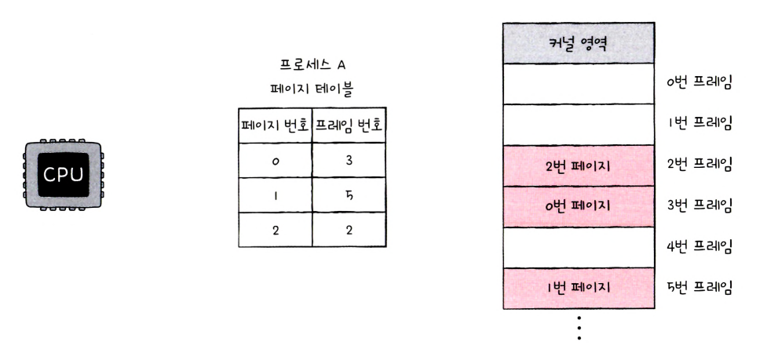
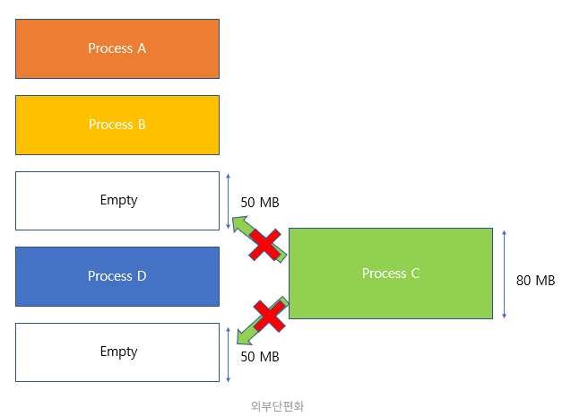
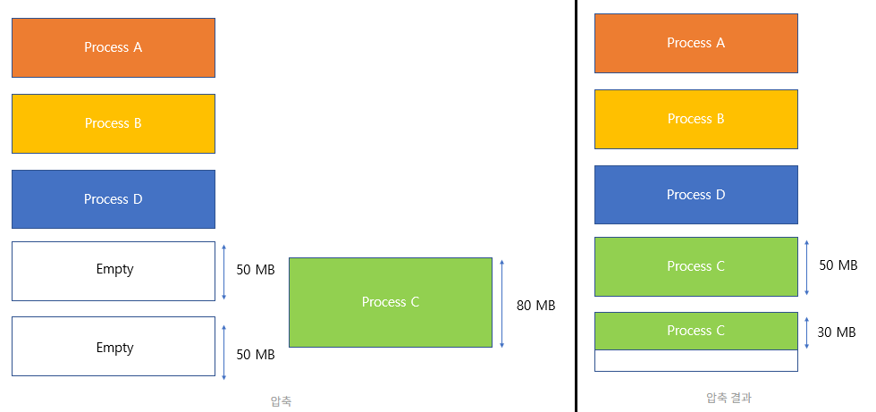
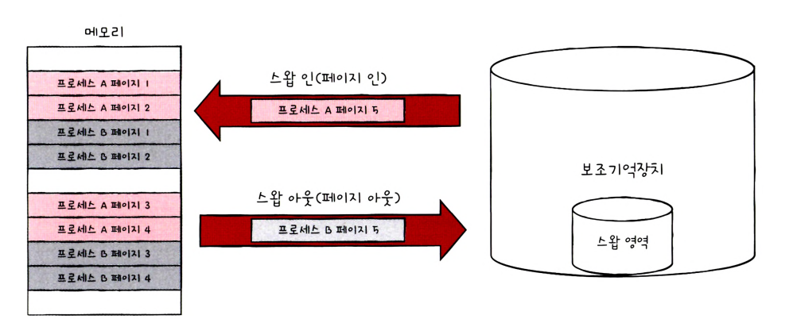
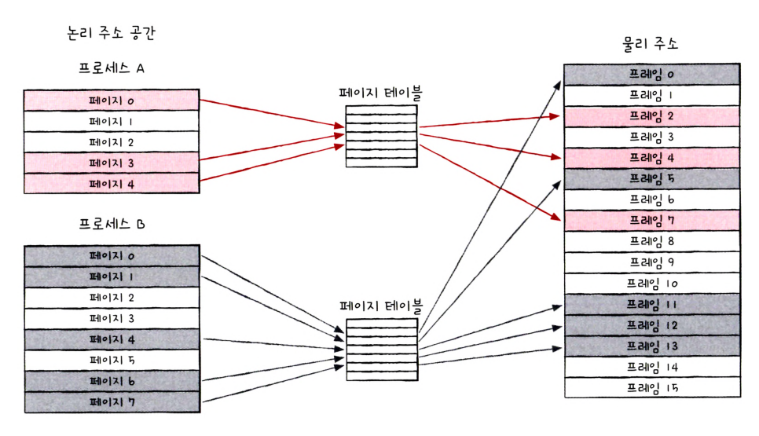
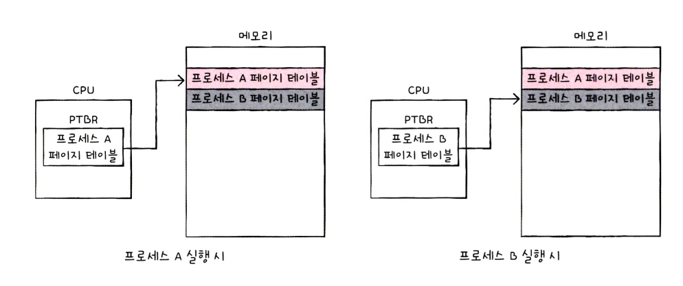
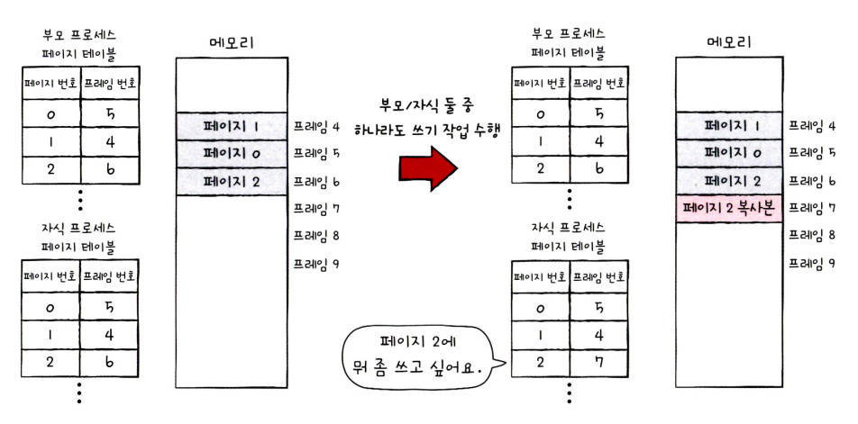
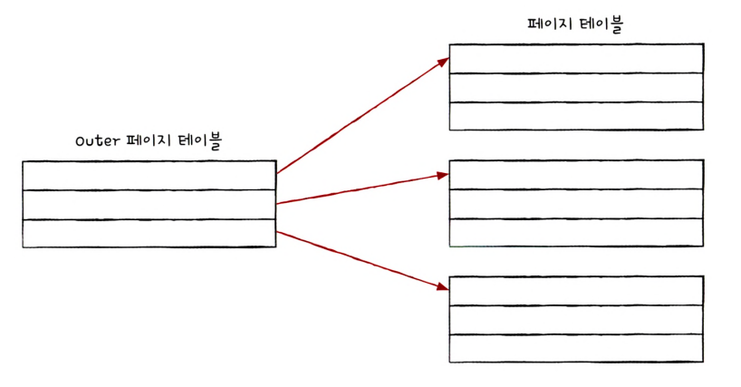
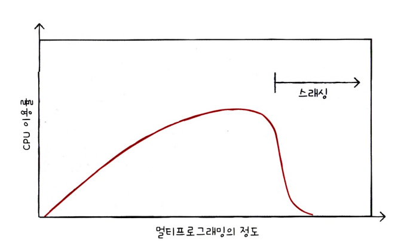
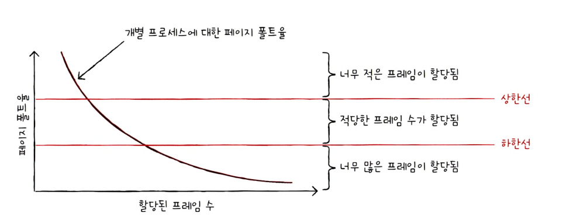

# 14단원 가상 메모리

연속 메모리 할당 : 프로세스에 연소적인 메모리 공간을 할당하는 방식

책에는 세그먼트 얘기가 빠졌다 → 현재 OS가 사용하는 페이징 기법 위주로 설명됨

## 스와핑

메모리에 적재된 프로세스들 중에는 현재 실행되지 않는 프로세스가 있을 수 있다

ex)대기 상태의 프로세스, 오랫동안 사용X 프로세스

**스와핑** : 임시로 보조기억장치 일부 영역으로 쫓아내고, 빈 공간에 다른 프로세스를 적재하여 실행하는 방식

**스왑 영역** : 프로세스들이 쫓겨나는 보조기억장치의 일부 영역

**스왑 아웃** : 현재 실행되지 않는 프로세스가 메모리에서 스왑 영역으로 옮겨지는 것

**스왑 인** : 스왑 영역에 있던 프로세스가 다시 메모리로 옮겨오는 것

## 메모리 할당

메모리 내에 빈 공간이 여러 개 있다면 프로세스를 어디에 배치하냐?

**최초 적합(first fit)** : 운영체제가 메모리 내의 빈 공간을 순서대로 검색하다가 적재할 수 있는 공간을 발견하면 그 공간에 프로세스를 배치하는 방식

**최적 적합(best fit)** : 운영체제가 빈 공간을 모두 검색해 본 후, 적재될 수 있는 공간 중 가장 작은 공간에 프로세스를 배치

**최악 적합(worst fit)** : 운영체제가 빈 공간을 모두 검색해 본 후, 프로세스가 적재될 수 있는 공간 중 가장 큰 공간에 프로세스를 배치하는 방식

질문 : 최악 적합 방식은 왜 쓰나요?

## 외부 단편화

**외부 단편화** : 프로세스들이 메모리에 연속적으로 할당되는 환경에서는 프로세스들이 실행되고 종료되기를 반복하며 메모리 사이 사이에 빈 공간들이 생긴다. 프로세스 바깥에 생기는 빈 공간들은 그 공간보다 큰 프로세스르 적재하기 어려운 상황을 초래하고,  메모리 낭비로 이어진다

**발생 원인** : 각기 다른 크기의 프로세스가 메모리에 연속적으로 할당 되었기 때문

- 프로세스들의 크기가 모두 같으면 외부 단편화 발생 X

### 외부 단편화 해결 방법

**압축(compaction)** : 메모리 조각 모음. 흩어져 있는 빈 공간들을 하나로 모으는 방식으로 메모리 내에 저장된 프로세스를 적당히 재배치시켜 여기저기 흩어져 있는 작은 빈 공간들을 하나의 큰 빈 공간으로 만드는 방법

**단점 :** 메모리에 있는 내용을 옮기는 작업은 많은 오버헤드 발생

**한계** : 외부 단편화를 해결하기 위해 다양한 알고리즘(최적,최악,최초 적합 등)이 존재하지만 아무리 정교한 알고리즘이라도 외부 단편화를 피해갈 수는 없기 때문에 최대한 합리적인 선택을 할 수 밖에 없다. 

## 페이징

기존 방식의 문제점

- 외부 단편화
- 물리 메모리보다 큰 프로그램은 실행할 수 없다

**가상 메모리** : 실행하고자 하는 **프로그램을 일부만 메모리에 적재**하여 실제 물리 메모리 크기보다 더 큰 프로세스를 실행할 수 있게 하는 기술

**페이징(paging)** : 프로세스를 일정한 단위로 자르고 이를 메모리에 불연속적으로 할당하는 것. 외부 단편화는 발생하지 않는다

**페이지(page)** : 페이징을 통해 **프로세스**의 논리 주소 공간을 일정하게 자른 것(4KB, 8KB 다)

**프레임(frame)** : **메모리** 물리 주소 공간을 페이지와 동일한 크기의 일정한 단위로 자른 것

**페이징**은 메모리의 물리 주소 공간을 **프레임** 단위로 자르고, 프로세스의 논리 주소 공간을 페이지 단위로 다른 뒤 각 **페이지**를 프레임에 할당하는 가상 메모리 관리 기법입니다.

### 스와핑

페이징을 활용한 스와핑은 페이지 단위로 스왑 아웃/스왑 인

**페이지 아웃(page out)** : 메모리에 적재될 필요가 없는 페이지들은 보조기억장치로 스왑 아웃

**페이지 인(page in)** : 실행에 필요한 페이지들은 메모리로 스왑 인

즉, 한 프로세스가 실행하기 위해 프로세스 전체가 메모리에 적재될 필요 X

→ 물리 메모리보다 더 큰 프로세스를 실행할 수 있습니다.

<aside>
💡 내부 단편화

페이징은 외부 단편화 문제를 해결할 수 있지만, 내부 단편화라는 문제가 발생한다

모든 프로세스가 페이지 크기에 딱 맞게 잘리지 않는다. 

모든 프로세스는 페이지의 배수가 아니다

ex ) 108KB 프로세스, 10KB 페이지 : 마지막 페이지는 2KB 만큼의 크기가 남는다

페이지 크기가 작다면 발생하는 내부 단편화의 크기는 작아진다

페이지 크기를 너무 작게 설정하면 그만큼 페이지 테이블의 크기도 커지기 때문에 페이지 테이블이 차지하는 공간이 낭비된다. 

내부 단편화를 적당히 방지하면서 너무 크지 않은 페이지 테이블이 만들어지도록 페이지의 크기를 조정하는 것이 중요하다

</aside>

## 페이지 테이블

### 페이지 테이블이란

프로세스가 불연속적으로 배치되어 있다면 CPU가 이를 순차적으로 실행할 수 없음

이를 해결하기 위해 페이징 시스템은 비록 물리 주소에 불연속적으로 배치되더라도, 논리 주소에는 연속적으로 배치되도록 **페이지 테이블**을 활용한다

프로세스마다 각자의 프로세스 테이블을 가지고 있다

각 프로세스의 페이지 테이블들은 메모리에 적재되어있다

CPU 내의 **페이지 테이블 베이스 레지스터(page table base register, PTBR)**는 각 프로세스의 페이지 테이블이 적재된 주소를 가리키고 있다

)

### **TLB(Translation Lookaside Buffer)**

페이지 테이블을 메모리에 두면 메모리 접근 시간이 두 배로 늘어난다

- 메모리에 있는 페이지 테이블을 보기 위해
- 프레임에 접근하기 위해

이를 해결하기 위해 CPU 곁에(MMU 내에) **TLB(Translation Lookaside Buffer)**라는 **페이지 테이블의 캐시 메모리**를 둔다

TLB는 페이지 테이블의 캐시 메모리 역할을 수행하기 위해 페이지 테이블의 일부를 저장한다. 최근에 사용된 페이지 위주로 가져와 저장한다

TLB히트(TLB Hit) : CPU가 발생한 논리 주소에 대한 페이지 번호가 TLB에 있을 경우

TLB미스(TLB Miss) : 페이지 번호가 TLB에 없을 경우 페이지가 적재된 프레임을 알기 위해 메모리 내의 페이지 테이블에 접근하는 방식

### 페이징에서의 주소 변환

하나의 페이지 혹은 프레임은 여러 주소를 포괄하고 있다

- 어떤 페이지 혹은 프레임에 접근하고 싶은지
- 접근하려는 주소가 그 페이지 혹은 프레임으로부터 얼마나 떨어져 있는지(Offset)
- 

**페이지 번호(Page Number)** : 접근하고자 하는 페이지 번호. 페이지 테이블에서 해당 페이지 번호를 찾으면 어떤 프레임에 할당되었는지를 알 수 있다

**변위(Offset)** : 접근하려는 주소가 프레임의 시작 번지로부터 얼만큼 떨어져 있는지를 알기 위한 정보

<페이지 번호, offset> → <프레임 번호, offset>

## 페이지 테이블 엔트리 page table entry

**페이지 테이블 엔트리 page table entry** : 페이지 테이블의 각 행

페이지 번호, 프레임 번호, 유효 비트, 보호 비트, 참조 비트, 수정 비트

### 유효 비트

**유효 비트(Valid Bit)** : 현재 페이지에 접근 가능한지 여부를 알려준다. 현재 페이지가 메모리에 있는지 보조 기억장치에 있는지를 알려줌

프레임 번호 다음으로 중요한 정보

스와핑으로 인해 일부 페이지는 프레임이 아닌 스왑 영역에 존재한다

유효 비트는 현재 **페이지가** **메모리에 적재되어 있는지(1)** 아니면 **보조기억장치에 있는지(0)**를 알려준다

**페이지 폴트(page fault)** : CPU가 유효 비트가 0인 메모리에 적재되어 있지 않은 페이지로 접근하려고 하면 페이지 폴트라는 예외가 발생한다

**페이지 폴트 처리 과정**

1. CPU는 기존의 작업 내역을 백업한다
2. 페이지 폴트 처리 루틴을 실행한다
3. 페이지 처리 루틴은 원하는 페이지를 메모리로 가져온 뒤 유효 비트를 1로 변경해준다
4. 페이지 폴트를 처리했으면 CPU는 해당 페이지에 접근할 수 있다

### 보호 비트

**보호 비트(Protection Bit)** : 페이지 보호 기능을 위해 존재하는 비트

해당 페이지가 읽고 쓰기가 모두 가능한 페이지 인지, 읽기만 가능한 페이지인지 나타낼 수 있음

Read(r)/Write(w)/Execute(x)

### 참조 비트

**참조 비트(Reference Bit)** : CPU가 이 페이지에 접근한 적이 있는지 여부

적재 이후 CPU가 읽거나 쓴 페이지는 참조 비트가 1

적재 이후 한 번도 읽거나 쓴 적이 없는 페이지는 0

### 수정 비트/더티 비트

**수정 비트(Modified Bit)/더티 비트(Dirty Bit**) : 해당 페지이에 데이터를 쓴 적이 있는지 없는지 수정 여부

변경된 적이 있음 : 1

변경된 적이 없음(한번도 접근한 적 없거나, 읽기만 한 페이지) : 0

페이지가 메모리에서 사라질 때, 보조기억장치에 쓰기 작업을 해야 하는지, 할 필요가 없는지 판단

한 번도 수정된 적이 없는 페이지는 스왑 아웃될 경우 새로 적재된 페이지로 덮어쓰기만 하면된다

같은 페이지가 보조기억장치에 저장되어 있기 때문

수정된 적이 있으면 값을 보조기억장치에 기록해야한다

## 페이지의 이점 - 쓰기 복사

페이징을 통해 프로세스 간에 페이지를 공유할 수 있다

ex ) **쓰기 시 복사**(copy on write)

fork하면 부모 프로세스의 코드 및 데이터 영역이 다른 메모리 영역에 복사된다

→ 프로세스 생성 시간을 늦추고 메모리를 낭비한다

**쓰기 시 복사**를 하면 부모와 동일한 자식 프로세스가 생성되면 자식 프로세스로 하여금 부모 프로세스와 동일한 프레임을 가리킨다. 만일 부모 프로세스와 자식 프로세스가 메모리에 어떠한 데이터도 쓰지 않고 읽기 작업만 한다면 이 상태가 지속된다

쓰기 작업을 한다면 해당 페이지가 별도의 공간으로 복제된다

즉, **쓰기** 작업을 하면 해당 페이지를 **복사**한다

## 계층적 페이징

페이지 테이블은 생각보다 크다

→ 프로세스가 커지면 페이지 테이블도 커진다

→ 프로세스를 이루는 모든 페이지 테이블 엔트리를 항상 메모리에 유지하는 것을 메모리 낭비

→ **계층적 페이징** 등장

**계층적 페이징(Hierarchical Paging)/다단계 페이지 테이블(Multilevel Page Table) :** 페이지 테이블을 페이징하여 여러 단계의 페이지를 두는 방식

프로세스의 페이지 테이블을 여러 개의 페이지로 자른다

바깥쪽 페이지 테이블을 하나 더 두어 잘린 페이지 테이블의 페이지들을 가리키게 한다(마치 트리 구조와 같다)

페이지 테이블을 계층적으로 구성하면 모든 페이지 테이블을 항상 메모리에 유지할 필요가 없다

(페이지 번호 + 변위) 형태의 논리 주소에서 **(바깥 페이지 번호 + 안쪽 페이지 번호 + 변위)**로 바뀐다

- 바깥 페이지 번호를 통해 페이지 테이블의 페이지를 찾기
- 페이지 테이블의 페이지를 통해 프레임 번호를 찾기

꼭 2단계 만 있는 것이 아니라 3,4,+@단계 계층으로 구성될 수도 있음

페이지 테이블의 계층이 늘어날수록 페이지 폴트가 발생했을 경우 메모리 참조 횟수가 많아지기 때문에 무조건 좋은 것은 아니다

## 페이지 교체와 프레임 할당

한정된 메모리에 어떤 페이지를 할당할지를 판단하는 방법

### 요구 페이징(Demand Paging)

프로세스를 메모리에 적재할 때 필요한 페이지만을 메모리에 적재하는 기법

1. CPU가 특정 페이지에 접근하는 명령어 실행
2. 해당 페이지가 현재 메모리에 있을 경우(유효 비트가 1인 경우) 프레임에 접근
3. 메모리에 없는경우(유효 비트 0) 페이지 폴트 발생
4. 페이지 폴트 처리 루틴은 해당 페이지를 메모리에 적재하고 유효 비트 1로 설정
5. 1번 수행

**순수 요구 페이징(pure demand paging) :** 아무런 페이지도 메모리에 적재하기 않고 실행하는 경우도 있음

페이지 폴트 초반에 많이 발생 → 점점 빈도 감소

## 페이지 교체 알고리즘

일반적으로 페이지 폴트를 가장 적게 일으키는 알고리즘이 좋은 알고리즘

페이지 폴트 횟수를 알아야한다

**페이지 참조열(page reference string)** : CPU가 참조하는 페이지들 중 연속된 페이지를 생략한 페이지열. 중복된 페이지를 참조하는 행위는 페이지 폴트 X이기 때문에 제거

2 2 2 3 5 5 5 3 3 7 → 2 3 5 3 7

### FIFO 페이지 교체 알고리즘

가장 먼저 올라온 페이지부터, 가장 오래 머문 페이지부터 내쫓는 방식이다

적재 시간을 바탕으로 한다(?) 큐와는 조금 다른듯

### 2차 기회 페이지 교체 알고리즘 Second Change Page Replacement Algorithm

FIFO와 같지만 **참조 비트**가 1인 경우 0으로 만들고 현재 시간을 적재 시간으로 설정한다

### 최적 페이지 교체 알고리즘 Optimal Page Replacement Algorithm

CPU에 의해 참조되는 횟수를 고려하는 페이지 교체 알고리즘

앞으로 사용 빈도가 낮은 페이지, 오랫동안 사용하지 않을 페이지를 교체하는 알고리즘

단점 : 실제 구현이 어렵다. 앞으로 오랫동안 사용되지 않을 페이지를 예측하기가 어렵다

전투력 측정기로 사용한다 → 최적 페이지 교체에 비해 얼만큼 페이지 폴트 횟수가 발생하는지에 따라 알고리즘을 평가한다

### LRU(Least Recently Used) 페이지 교체 알고리즘

가장 오랫동안 사용되지 않은 페이지를 교체하는 알고리즘

최근에 사용되지 않은 페이지는 앞으로도 사용되지 않을 것을 기반으로 만들어짐

## 스래싱과 프레임 할당

페이지 폴트가 발생하는 원인 중 알고리즘 외적인 요소

프로세스가 사용할 수 있는 프레임 수가 적은 경우 페이지 폴트 발생

반대로 프로세스가 사용할 수 있는 프레임 수가 많으면 페이지 폴트 빈도 감소

**스래싱(Thrashing)** : 프로세스가 실제 실행되는 시간보다 페이징에 더 많은 시간을 소요하여 성능이 저해되는 문제

**멀티 프로그래밍 정도** : 메모리에서 실행 중인 프로세스

동시에 실행되는 프로세스 수가 어느 정도 증가하면 CPU 이용률이 높아지지만, 필요 이상으로 늘리면 각 프로세스들이 사용할 수 있는 프레임 수가 적어지기 때문에 페이지 폴트가 지나치게 빈번히 발생하고,  CPU 이용률이 떨어진다

아무리 CPU 성능이 좋아도 물리 메모리가 너무 작다면 전체 컴퓨터의 성능이 안좋다

스래싱이 발생하는 근본적인 이유는 프로세스가 필요로 하는 최소한의 프레임 수가 보장되지 않기 때문 _> 사용 프레임 수가 낮으면 페이지 폴트가 자주 발생

### 프레임 할당 방식

**균등 할당(equal allocation)** : 모든 프로세스에게 동일하게 할당

단점 : 프로세스마다 필요량이 달라 좋지 않은 방법

**비례 할당(proportional allocation)** : 크기가 큰 프로세스에게 프레임을 많이 할당 

단점 : 프로세스는 크지만 많은 프레임을 필요하지 않을 수도

**작업 집합 모델(working set model)**

Working Set의 크기만큼 프레임을 할당한다. 프로세스가 일정 기간 동안 참조한 페이지 집합을 기억한다.

CPU가 메모리를 참조할 때에는 참조 지역성의 원리에 의해 주로 비슷한 구역을 집중적으로 참조

특정 시간 동안에는 몇몇 개의 페이지만을 집중적으로 참조한다

CPU가 과거에 주로 참조한 페이지를 **작업 집합(working set)**에 포함한다면 운영체제는 working set 크기만큼만 프레임을 할당해 준다

**작업 집합(working set) :** 실행 중인 프로세스가 일정 시간 동안 참조한 페이지의 집합

**페이지 폴트 빈도(PFF:page fault frequency)**

페이지 폴트 빈도 기반 프레임 할당 방식은 페이지 폴트율에 상한선과 하한선을 정하고, 이 범위 안에서만 프레임을 할당하는 방식

두 가지 아이디어에서 파생됨 : 

1. 페이지 폴트율이 너무 높으면 그 프로세스는 너무 적은 프레임을 갖고 있다
2. 페이지 폴트율이 너무 낮으면 그 프로세스가 너무 많은 프레임을 갖고 있다

만약 페이지 폴트율이 상한선보다 더 높아지면 그 프로세스는 너무 적은 프레임을 갖고 있다고 판단하고 프레임을 더 할당해준다 and vice versa.

**Working Set Model**과 **PFF(Page Fault Frequency)** 두 개 방식은 프로세스의 실행을 보고 할당할 프레임 수를 결정한다는 점에서 **동적 할당 방식**