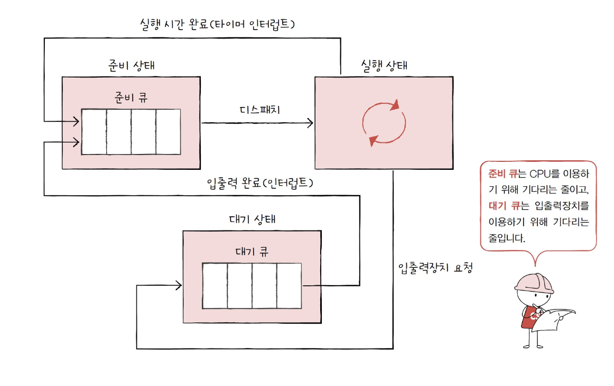

# CPU 스케줄링
## 11-1 CPU 스케줄링 개요

> 스케쥴링이란 ?
운영체제가 프로세스를 합리적으로 CPU 자원을 배분하는 것을 말한다.
> 

## 프로세스의 우선 순위

입출력 집중 프로세스 

- 입출력 작업이 많은 프로세스.
- 실행 상태보다는 입출력을 위한 대기 상태에 더 많이 머무른다.
- 비디오 재생, 디스크 작업
- 입출력장치를 기다리는 작업 : 입출력 버스트가 높음

CPU 집중 프로세스

- 복잡한 수학 연산, 컴파일, 그래픽 처리 등을 다루는 작업
- 대기 상태보다는 실행 상태에 더 많이 머무름
- CPU를 이용하는 작업 : CPU 버스트가 높음

> 보통 입출력 프로세스가 우선 순위가 높음.

그 이유는 입출력 프로세스는 cpu집중 프로세스보다 대기 시간이 길기 때문에 입출력을 처리해 놓고 나머지 cpu집중 프로세스를 하는 것이 효율적이기 때문이다.
> 

운영체제는 PCB에 우선순위를 명시하고, 적힌 우선순위를 기준으로 먼저 처리할 프로세스를 결정한다. 

우선순위가 높은 프로세스는 더 빨리, 더 자주 실행됨.

## 스케쥴링 큐

운영체제가 프로세스들을 우선순위에 의해 줄 세우는 것을 스케줄링 큐로 구현하고 관리한다.

여러가지 큐가 있지만 준비 큐와 대기 큐가 있다.

준비 큐

- CPU를 이용하고 싶은 프로세스들이 서는 줄

대기 큐

- 입출력장치를 이용하기위해 대기 상태에 접어든 프로세스들이 서는 줄

### 준비 큐

준비 상태에 있는 프로세스들의 PCB는 준비 큐의 마지막에 삽입되어 CPU를 사용할 차례를 기다린다. 운영체제는 PCB들이 큐에 삽입된 순서대로 프로세스를 하나씩 꺼내어 실항해되, 그중 우선순위가 높은 프로세스를 먼저 실행한다.

### 대기 큐

준비 큐와 마찬가지로 작업이 완료될 떄 까지 기다리고 있음.

완료 인터럽트가 발생하면 운영체제는 대기 큐에서 작업이 완료된 PCB를 찾고, 이 PCB를 준비 상태로 변경한 뒤 대기 큐에서 제거. 준비큐로 이동시킴.

### 선점형과 비선점형 스케줄링

선점형 스케줄링

> 프로세스가 CU를 비롯한 자원을 사용하고 있더라도 운영체제가 프로세스로부터 자원을 강제로 빼앗아 다른 프로세스에 할당할 수 있는 스케줄링 방식
> 
- 정해진 시칸만큼 사용한 후 인터럽트가 발생하면 운영체제가 해당 프로세스로부터 CPU 자원을 빼앗아 다음 프로세스에 할당하는 방식도 선점형 스케줄링의 일종
- 독점이 불가능하다.
- 자원 독점을 막고 프로세스들에 골고루 자원 배분 가능
- 교환 과정에서 오버헤드가 크다.

비선점형 스케줄링

> 하나의 프로세스가 자원을 사용하고 있다면 그 프로세스가 종료되거나 스스로 대기 상태에 접어들기 전까지 다른 프로세스가 끼어들 수 없는 스케줄링 방식
> 
- 독점이 가능하다.
- 모든 프로세스가 골고루 자원을 사용할 수 없다.
- 오버헤드가 덜 하다.

# CPU 스케줄링 알고리즘

## 선입 선처리(First Come First Served: FCFS) 스케줄링 - 비선점형

- FCFS 스케줄링
- 삽입된 순서대로 프로세스 처리
- 호위효과가 나타남.
    - 평균 대기시간이 길어질 수 있다.
    

## 최단 작업 우선 스케줄링(Shortest Job First Scheduling: SJF) - 비선점형

- 호위 효과를 방지하기 위해 나타남.
- 준비 큐에 삽입된 프로세스들 중 CPU 이용 시간의 길이가 가장 짧은 프로세스부터 실행하는 스케줄링 방식.

## 라운드 로빈 스케줄링 - 선점형

- 선입 선처리 + 타임 슬라이스라는 개념이 더해진 스케줄링 방식
    - 타임 슬라이드 : 각 프로세스가 CPU를 사용할 수 있는 정해진 시간

> 타임 슬라이스가 매우 중요. 
타임 슬라이스가 클 경우 - 선입 선처리 스케줄링과 다를 바 없어 호위 효과 생김
작으면 - 문맥교환에 발생하는 비용이 커 CPU는 프로세스를 처리하는 일보다 프로세스 전환하는데 힘을 다 쓸 수 있음.
> 

## 최소 잔여 시간 우선 스케줄링(Shortest Remaining Time : SRT) - 선점형

- 최단 작업 우선 스케줄링 + 라운드 로빈
- 최소 잔여 시간 우선 스케줄링 하에서 프로세스들은 정해진 타임 슬라이스만큼 CPU를 사용하되, CPU를 사용할 다음 프로세스는 남아있는 작업 시간이 가장 적은 프로세스가 선택됨.

## 우선순위 스케줄링

- 우선순위를 부여하고 가장 높은 우선순위를 가진 프로세스부터 실행하는 알고리즘
- 최단작업 우선 스케줄링, 최소 잔여 시간 우선 스케줄링 → 우선순위 스케줄링
- 문제점 : 기아 현상이 나타남
    - 기아 현상이란 우선순위가 높은 프로세스를 우선하여 처리하는 방식이기 때문에 우선순위가 낮은 프로세스는 우선순위가 높은 프로세스들에 의해 실행이 계속해서 연기되는 현상
- 문제 해결 방안 : 에이징
    - 에이징이란 오랫동안 대기한 프로세스의 우선순위를 점차 높이는 방식.

## 다단계 큐 스케줄링(Multilevel queue scheduling)

- 우선순위 큐 발전한 형태
- 우선순위별로 준비 큐를 여러개 사용하는 스케줄링
- 다단계 큐 스케줄링 하에서는 우선순위가 가장 높은 큐에 있는 프로세스들을 먼저 처리하고, 우선순위가 가장 높은 큐가 비어있으면 그다음 우선순위 큐에 있는 프로세스들을 처리한다.
- 프로세스 유형별로 우선순위를 구분하여 실행할 수 있다.
- 큐마다  다른 스케줄링을 적용할 수 있다.
- 프로세스들이 큐 사이를 이동할 수없다. → 기아현상 발생 가능

## 다단계 피드백 큐 스케줄링

- 다단계 큐 + 큐 사이 이동 가능.
- 오래 사용되는 프로세스는 점차 우선순위가 낮아짐
- 프로세스들이 큐 사이를 이동할 수 있는 방식이기 때문에 낮은 우선순위 큐에서 너무 오래 기다리는 프로세스가 있다면 점차 우선순위가 높은 큐로 이동시키는 에이징 기법을 적용하여 기아현상 예방 가능.
- 다단계 피드백 큐 스케줄링 알고리즘은 어떤 프로세스의 CPU이용시간이 길면 낮은 우선순위 큐로 이동시키고, 어떤 프로세스가 낮은 우선순위 큐에서 너무 오래 기다린다면 높은 우선순위큐로 이동시킬 수 있는 알고리즘