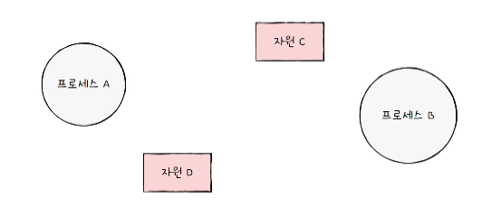
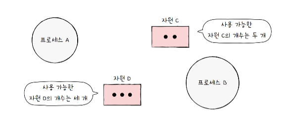
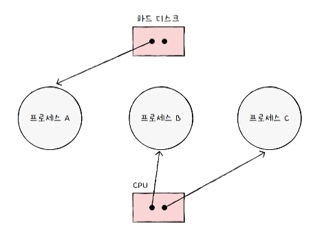
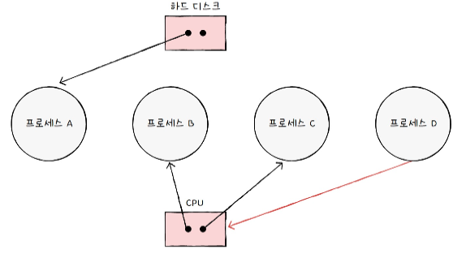
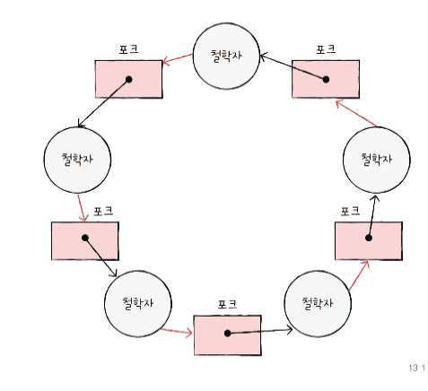

# 교착상태란?

## 식사하는 철학자 문제

가정 

1. 동그란 원탁에 다섯 명의 철학자 앉음
2. 척학자들 사이 사이에는 식사에 필요한 포크가 있음
3. 철학자들은 앞에 있는 식사는 두 개의 포크로 먹을 수 있는 음식이라고 가정

순서 

1. 계속 생각을 하다가 왼쪽 포크가 사용 가능하면 집어든다.
2. 계속 생각을 하다가 오른쪽 포크가 사용 가능하면 집어든다.
3. 왼쪽과 오른쪽 포크를 모두 집어들면 정해진 시간동안 식사를 한다.
4. 식사 시간이 끝나면 오른쪽 포크를 내려놓는다.
5. 오른쪽 포크를 내려놓은 뒤 왼쪽 포크를 내려놓는다.
6. 다시 1번부터 반복

문제?

모든 철학자가 동시에 포크를 집어 식사 못함

모든 철학자는 다른 철학자가 포크를 내려놓을 떄 까지 기다림.

### 교착상태

일어나지 않을 사건을 기다리며 진행을 멈춰 버리는 현상

### 해결 방안

1. 교착상태가 발생했을 떄의 상황을 정확히 표현해 보고
2. 교착 상태가 일어나는 근본적인 이유에 대해 알아야 한다.

## 자원 할당 그래프

> 어떤 프로세스가 어떤 자원을 사용하고 있고, 또 어떤 프로세스가 어떤 자원을 기다리고 있는지를 간단하게 표현한 그래프
> 

### 첫째, 프로세스는 원으로, 자원의 종류는 사각형으로 표현

### 둘째, 사용할 수 있는 자원의 개수는 자원 사각형 내에 점으로 표현

### 셋쨰, 프로세스가 어떤 자원을 할당받아 사용 중이라면 자원에서 프로세스를 향해 화살표를 표시

### 넷째, 프로세스가 어떤 자원을 기다리고 있다면 프로세스에서 자원으로 화살표를 표시

식사하는 철학자의 경우에는 

이렇게 표현이 가능하다.

## 교착 상태 발생 조건

1. 상호 배제
2. 점유와 대기
3. 비선점
4. 원형 대기

> 조건 중 하나라도 만족하지 않는다면 교착 상태가 발생하지 않는다.
다시 말해, 모든 조건이 만족해야 교착상태가 발생할 가능성이 있다.
> 

### 상호 배제

한 프로세스가 사용하는 자원을 다른 프로세스가 사용할 수 없을 때 발생

### 점유와 대기

자원을 할당받은 상태에서 다른 자원을 할당받기를 기다리는 상태

### 비선점

다른 프로세스의 자원을 강제로 빼앗지 못했기 때문에 발생한다.

### 원형 대기

자원 할당 그래프가 원의 형태로 그려지면 발생. 어떤 프로세스들이 원의 형태로 자원을 대기하는 것

> 자원 할당 그래프가 원의 형태를 띄지 않는다면 교착 상태는 발생하지 않으나, 원의 형태를 띈다고 해서 반드시 교착 상태가 발생하는 것은 아님
> 

# 교착 상태 해결 방법

## 교착 상태 예방

상호 배제, 점유와 대기, 비선점, 원형 대기 중 하나의 조건이라도 만족하지 않게 할당하면 교착 상태는 발생하지 않는다.

### 상호 배제 없애기

- 상호 배제를 없앤다 == 모든 자원을 공유 가능하게 만든다.

### 점유와 대기 없애기

점유와 대기를 없애면 운영체제는 특정 프로세스에 자원을 모두 할당하거나 아예 할당하지 않는 방식으로 배분

- 문제점
    - 한 프로세스에 필요한 자원들을 몰아주고, 그 다음에 다른 프로세스에 필요한 자원들을 몰아줘야 한다. 당장 자원이 필요해도 기다릴 수밖에 없는 프로세스와 사용되지 않으면서 오랫동안 할당되는 자원을 다수 양산하기 때문에 자원의 활용률이 낮아진다.
    - 많은 자원을 사용하는 프로세스가 불리해짐.
        - 적게 사용하는 프로세스에 비해 동시에 자원을 사용할 타이밍을 확보하기가 어렵기 때문
        - 기아현상을 야기할 우려가 있다.

### 비선점 조건을 없애기

비선점 조건을 없애면 됨.

선점하여 사용할 수 있는 일부 자원에 대해서는 효과적

하지만 모든 자원이 선점 가능한 것은 아님.

ex 프린터

그래서 비선점 조건을 없애 모든 자원을 빼앗을 수 있도록 하여 교착 상태를 예방하는 방법은 다소 범용성이 떨어지는 방법.

### 원형 대기 조건 없애기

모든 자원에 번호를 붙이고, 오름차순으로 자원을 할당하면 원형 대기는 발생하지 않음.

- 문제점
    - 모든 컴퓨터 시스템 내에 존재하는 수많은 자원에 번호를 붙이는 작업은 어렵다. 어떤 자원에 번호를 붙이는지에 따라 특정 자원의 활용률이 떨어진다.

## 교착 상태 회피

> 교착 상태가 발생하지 않을 정도로만 조심 조심 자원을 할당하는 방식.
이 방식에서는 교착 상태를 한정된 자원의 무분별한 할당으로 인해 발생하는 문제라고 간주
> 

프로세스들에 배분할 수 있는 자원의 양을 고려하여 교착 상태가 발생하지 않을 정도의 양만큼만 자원을 분배하는 방법

회피하는 방법 2가지

- 안전 상태
    - 교착 상태가 발생하지 않고 모든 프로세스가 정상적으로 자원을 할당받고 종료될 수 있는 상태
    - 교착 상태 없이 안전하게 프로세스들에 자원을 할당할 수 있는 순서를 의미
    - 안전 순서열이 있는 상태 = 안전 상태
    - 안전 순서열대로 프로세스들에 자원을 배분하여 교착 상태가 발생하지 않는 상태
- 불안전 상태
    - 교착 상태가 발생할 수도 있는 상황
    - 안전 순서열이 없는 상황

`교착 상태 회피`는 안전 상태를 유지하도록 자원을 할당하는 방식

## 교착 상태 검출 후 회복

교착 상태 발생을 인정하고 사후에 조치하는 방식

운영체제는 프로세스들이 자원을 요구할 때 마다 그떄그때 모두 할당

주기적으로 교착 상태 발생 여부 확인

### 선점을 통한 회복

교착 상태가 해결될 때까지 한 프로세스씩 자원을 몰아주는 방식.(다른 프로세스로부터 자원을 강제로 뺴앗고 할당)

### 프로세스 강제 종료를 통한 회복

단순하며 확실함.

1. 교착상태에 놓인 프로세스를 모두 강제 종료
    1. 확실하지만 프로세스들이 작업 내역을 잃게 될 가능성이 있음
2. 교착 상태가 없어질 떄까지 한 프로세스씩 강제 종료
    1. 작업 내역을 잃는 프로세스는 최대한 줄일 수 있지만 교착 상태가 없어졌는지 여부를 확인하는 과정에서 오버헤드가 발생

타조 알고리즘 : 잠재적 문제를 무시로 대처하는 방식
