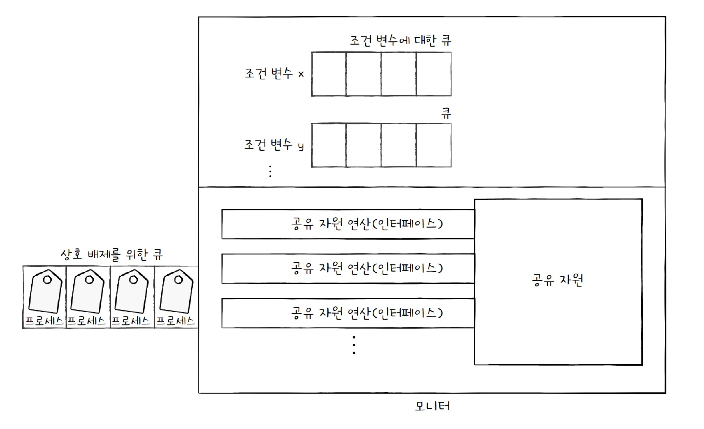

# 동기화

> 프로세스 동기화란?
프로세스들 사이의 수행 시기를 맞추는 것을 의미
 - 실행 순서 제어 : 프로세스를 올바른 순서대로 실행하기
 - 상호 배제 : 동시에 접근해서는 안 되는 자원에 하나의 프로세스만 접근하게 하기
> 
- 실행의 흐름을 갖는 모든 것은 동기화의 대상

## 동기화의 종류 2가지

1. 실행 순서를 제어하기 위한 동기화
2. 상호 배제를 위한 동기화

### 실행 순서 제어를 위한 동기화

### 상호 배제를 위한 동기화

상호 배제는 공유가 불가능한 자원의 동시 사용을 피하기 위해 사용하는 알고리즘.

동시에 접근해서는 안 되는 자원에 동시에 접근하지 못하게 하는 것 상호 배제를 위한 동기화이다.

### 생산자 소비자 문제

생산자와 소비자가 동시에 접근해서는 안 되는 자원에 동시에 접근해서 발생하는 문제임

## 공유 자원과 임계구역

공유 자원

> 공동으로 이용하는 변수, 파일, 장치 등의 자원
> 

임계 구역

> 공유 자원에 접근하는 코드 중 동시에 실행하면 문제가 발생하는 코드 영역
> 
- 두 개 이상의 프로세스가 임계구역에 진입하려고 하면 둘 중 하나는 대기한다.
- 리고 먼저 진입한 프로세스가 작업을 마무리하면 다음 프로세스가 진입하게 된다.


레이스 컨디션

> 잘못된 실행으로 인해 여러 프로세스가 동시 다발적으로 임계 구역의 코드를 실행하여 문제가 발생하는 경우
> 
- 데이터의 일관성이 깨지는 문제가 생긴다.

## 운영체제의 해결 법

운영체제는 임계 구역 문제를 세 가지 원칙하에 해결한다.

= 상호 배제를 위한 동기화를 위해서 반드시 지켜야만 하는 세 가지 원칙이다.

- 상호 배제
    - 한 프로세스가 임계 구역에 진입했다면 다른 프로세스는 임계 구역에 들어올 수 없다.
- 진행
    - 임계 구역에 어떤 프로세스도 진입하지 않았다면 임계 구역에 진입하고자 하는 프로세스는 들어갈 수 있어야 한다.
- 유한 대기
    - 한 프로세스가 임계 구역에 진입하고 싶다면 그 프로세스는 언젠가는 임계 구역에 들어올 수 있어야 한다.(임계 구역에 들어오기 위해 무한정 대기해서는 안 된다.)

# 동기화 기법

## 뮤텍스 락

> 동시에 접근해서는 안 되는 자원에 동시에 접근하지 않도록 만드는 도구이다.
상호 배제를 위한 동기화 도구이다.
> 

구현은 1개의 전역변수 2개의 함수로 구현이 가능하다.

- 자물쇠 역할: 프로세스들이 공유하는 전역 변수 lock
- 임계 구역을 잠그는 역할: acquire 함수
- 임계 구역의 잠금을 해제하는 역할 : release함수

### acquire 함수

> 프로세스가 임계 구역에 진입하기 전에 호출하는 함수.
임계 구역이 잠겨 있따면 열릴 때 까지 임계 구역을 반복적으로 확인
열려 있다면 임계 구역을 잠그는 함수
> 

### release함수

> 임계 구역에서의 작업이 끝나고 호출하는 함수
현재 잠긴 임계 구역을 열어주는 함수
> 


### 총 프로세스

1. 락을 획득할 수 없다면(임계 구역에 진입할 수 없다면) 무작정 기다림
2. 락을 획득할 수 있다면(임계 구역에 진입할 수 있다면) 임계 구역을 잠근 뒤 작업을 진행
3. 임계 구역에서 빠져나올 때 다시 임계 구역의 잠금을 해제

바쁜 대기

> While로 계속 확인하는 것
> 

## 세마포

뮤텍스 = 하나의 고융 자원에 접근하는 프로세스를 상정한 방식

세마포는 공유 자원이 여러 개 있는 상황에서도 적용이 가능한 동기화 도구

- 이진 세마포
- 카운팅 세마포

구현

- 전역변수 S
    - 임계 구역에 진입할 수 있는 프로세스의 개수(사용 가능한 공유 자원의 개수)를 나타냄
- wait 함수
    - 임계 구역에 들어가도 좋은지, 기다려야 할지를 알려주는 함수
- signal 함수
    - 임계 구역 앞에서 기다리는 프로세스에 ‘이제 가도 좋다’고 신호를 주는 함수
    

S는 현재 비어있는 공유자원의 갯수

Wait

```java
wait(){
	while(S <= 0){}
	S--;
}
```

Signal

```java
signal(){ S++; }
```

세마포도 뮤텍스 락 처럼 무한정 기다리게 되는 문제가 발생 가능함.

더 나은 방법

1. wait함수는 만일 사용할 수 있는 자원이 없을 경우 해당 프로세스 상태를 대기 상태로 만들고, 그 프로세스의 PCB를 세마포를 위한 대기 큐에 집어 넣는다.
2. 다른 프로세스가 임계 구역에서의 작업이 끝나고 signal 함수를 호출하면 signal함수는 대기 중인 프로세스를 대기 큐에서 제거하고, 프로세스 상태를 준비 상태로 변경한 뒤 준비 큐로 옮겨준다.

```java
wait(){
	S--;
	if(S < 0){
		//add this process to Queue;// 해당 프로세스 PCB를 대기 큐에 삽입
		sleep(); // 대기 상태로 접어든다.
	}
}
```

```java
signal(){
	S++;
	if(S <= 0){
		//remove a process p from Queue; 대기 큐에 있는 프로세스 p를 제거
		wakeup(p); //프로세스 p를 대기 상태에서 준비 상태로 만듦
	}
}
```

# 모니터

> 공유 자원과 공유 자원에 접근하기 위한 인터페이스를 묶어 관리한다.
그리고 반드시 인터페이스를 통해서만 공유 자원에 접근하도록 한다.
> 

모니터를 통해 공유 자원에 접근하고자 하는 프로세스를 큐에 삽입하고, 큐에 삽입된 순서대로 하나씩 공유 자원을 이용하도록 한다.

- 공유 자원을 다루는 인터페이스에 접근하기 위한 큐(모니터에 접근하기 위한 큐)를 만들고, 모니터 안에 항상 하나의 프로세스만 들어오도록 하여 상호 배제를 위한 동기화를 제공한다.


세마포어와 마찬가지로 실행 순서를 제어를 위한 동기화 제공

특정 조건 바탕으로 프로세스를 실행하고 일시 중단하기 위해 조건 변수를 사용.

> 조건 변수는 프로세스나 스레드의 실행 순서를 제어하기 위해 사용하는 특별한 변수
> 



조건 변수는 wait, signal 연산 수행할 수 있다.

- wait 호출한 프로세스의 상태를 대기 상태로 전환하고 일시적으로 조건 변수에 대한 대기 큐에 삽입하는 연산
- 모니터에 집입하기 위해 삽입된 큐(상호 배제를 위한 큐) ≠ wait가 호출되어 실행이 중단된 프로세스들이 삽입되는 큐(조건 변수에 의한 큐)

상호 배제를 위한 큐 = 모니터에 한 번에 하나의 프로세스만 진입할 수 있도록 하기 위해 만들어진 큐

조건 변수에 의한 큐 = 모니터에 이미 진입한 프로세스의 실행 조건이 만족될 때까지 잠시 실행이 중단되어 기다리기 위해 만들어진 큐

1. 특정 프로세스가 아직 실행될 조건이 되지 않았을 때는 wait을 통해 실행을 중단
2. 특정 프로세스가 실행될 조건이 충족되었을 때에는 signal을 통해 실행