# 프로세스

> 실행 중인 프로그램

실행 전까지는 보조기억장치에 있는 데이터 덩어리일 뿐이지만, 보조기억장치에 저장된 프로그램을 메모리에 적재하고 실행하는 순간 그프로그램은 프로세스가 된다. == 프로세스를 생성한다.

포그라운드 프로세스 - 사용자가 보는 곳에서 실행

백그라운드 프로세스 - 사용자가 보지 못하는 뒤편에서 실행되는 프로세스

- 데몬 - 유닉스
- 윈도우 - 서비스

### 프로세스 제어 블록

CPU의 자원은 한정되어 있다. 그래서 모든 프로세스를 동시에 실행 불가능.

그래서 프로세스들은 차례대로 돌아가며 한정된 시간만큼 CPU를 이용한다.

정해진 시간만큼 CPU를 사용하고 시간이 끝났음을 알리는 인터럽트(타이머 인터럽트)가 발생하면 자신의 차례를 양보하고, 다시 자신의 차례를 기다린다.

> 타이머 인터럽트(타임아웃 인터럽트)
> 클럭 신호를 발생시키는 장치에 의해 주기적으로 발생하는 하드웨어 인터럽트.

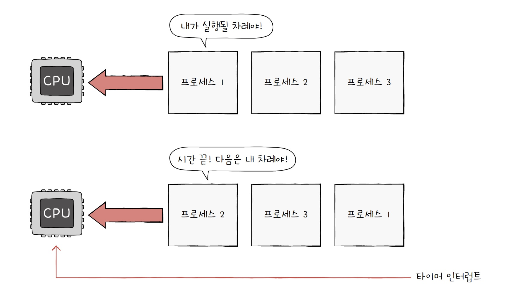

운영체제는 빠르게 번갈아 수행되는 프로세스의 실행 순서를 관리하고, 프로세스에 CPU를 비롯한 자원을 분배한다. 이를 위해 운영체제는 프로세스 제어 블록(PCB : process control block)을 이용

> PCB
> 프로세스와 관련된 정보를 저장하는 자료 구조
> 프로세스를 식별하기 위해 꼭 필요한 정보들을 저장한다.
> 운영체제는 PCB로 프로세스를 식별하고, 처리하는 데 필요한 정보를 판단

라이프 사이클

> 프로세스 생성 될 때 PCB생성
> 프로세스 종료 될 때 PCB폐기

### PCB블록에 들어가는 정보

1. Process ID(PID)
   - 프로세스를 식별하기 위한 고유한 번호
2. 레지스터 값
   - 자신의 실행 차례가 돌아오면 이전까지 사용했던 레지스터의 중간값들을 모두 복원
   - 프로세스가 실행하며 사용했던 프로그램 카운터를 비롯한 레지스터 값들이 담김
3. 프로세스 상태
   - 입출력장치를 사용하기 위해 기다리고 있는 상태
   - CPU를 사용하기 위해 기다리고 있는 상태
   - CPU를 이용하고 있는 상태
   - 기타 등등……
4. CPU 스케줄링 정보
   - 언제, 어떤 순서로 CPU를 할당받을지에 대한 정보
5. 메모리 관리 정보
   - 메모리 주소 정보
     - 베이스 레지스터, 한계 레지스터 값과 같은 정보
   - 주소를 알기 위해 페이지 테이블 정보
6. 사용한 파일과 입출력장치 목록

   - 어떤 입출력장치가 이 프로세스에 할당되었는지, 어떤 파일들을 열었는지에 대한 정보들이 PCB에 기록된다.

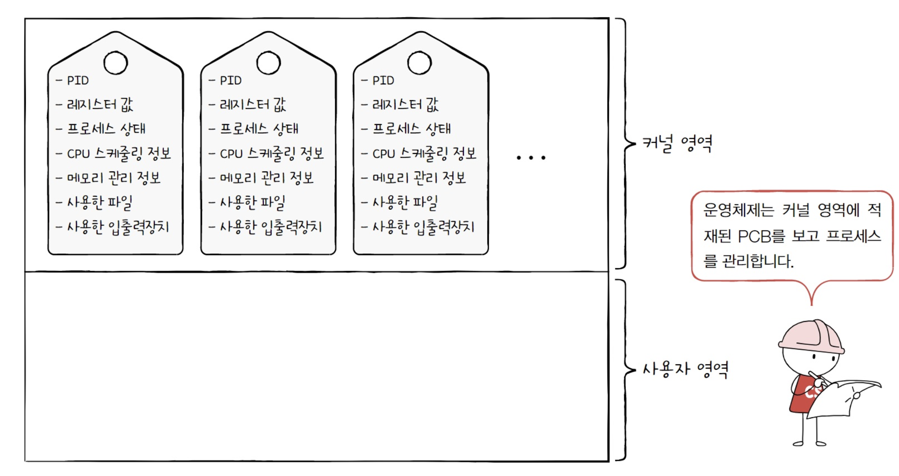

### 문맥

> 하나의 프로세스 수행을 재개하기 위해 기록해야 할 정보
> 하나의 프로세스 문맥은 해당 프로세스의 PCB에 표현되어 있다.

문맥 교환 ?

- 기존 프로세스 문맥을 PCB에 백업하고, 새로운 프로세스를 실행하기 위해 문맥을 PCB로부터 복구하여 새로운 프로세스를 실행하는 것.

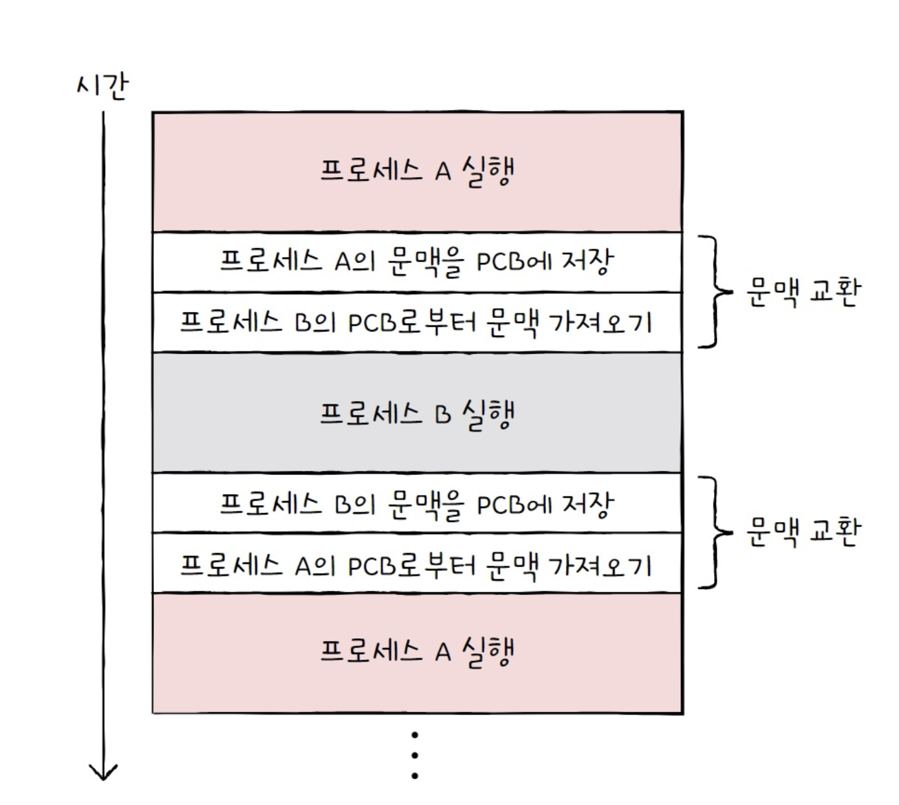

문맥 교환은 여러 프로세스가 끊임없이 빠르게 번갈아 가며 실행되는 원리

⚠️ 주의 : 너무 자주하면 오버헤드가 발생

## 프로세스의 메모리 영역( 중요! )

> 프로세스는 사용자 영역에 크게 코드 영역, 데이터 영역, 힙 영역, 스택 영역으로 나누어 저장

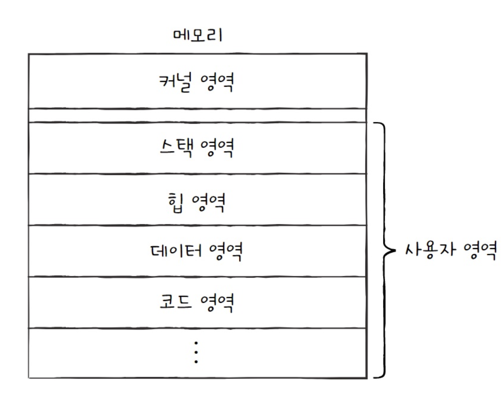

### 코드 영역(텍스트 영역)

기계어로 이루어진 명령어가 저장. READ ONLY!

### 데이터 영역(정적 할당 영역)

잠깐 썼다가 없앨 데이터가 아닌 프로그램 실행되는 동안 유지할 데이터가 저장되는 공간.

전역변수가 대표적

크기가 고정된 영역

### 힙 영역(동적 할당 영역)

프로그래머가 직접 할당할 수 있는 저장 공간

힙메모리에 공간을 할당했으면 반납해야함.

반납 안하면 메모리 누수가 일어남

### 스택영역(동적 할당 영역)

데이터를 일시적으로 저장하는 공간

함수 실행이 끝나면 사라지는 매개 변수, 지역 변수 등.

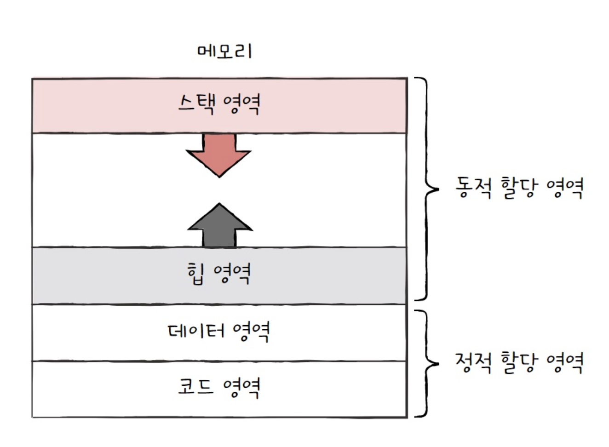

‘

# 프로세스의 상태와 계층 구조

## 프로세스 상태

### 생성 상태

생성 중인 상태. 이제 막 메모리에 적재되어 PCB를 할당받은 상태.

생성 상태를 거쳐 실행 준비가 완료된 프로세스는 곧 바로 시작하지 않고 준비 상태가 되어 CPU의 할당을 기다림

### 준비 상태

당장이라도 CPU를 할당받아 실행할 수 있지만, 아직 자신 차례가 아니기에 기다리는 상태

> 준비상태인프로세스가실행상태로전환되는것을디스패치(dispatch)라고합니다.

### 실행 상태

CPU를 할당받아 실행 중인 상태

할당된 시간을 다 쓰면 다시 준비상태가 됨. 실행 도중 입출력장치를 사용하여 입출력 장치의 작업이 끝날 때까지 기다려야 한다면 대기 상태가 됨.

### 대기 상태

실행 도중 입출력장치의 작업을 기다리는 상태를 대기 상태라고 함.

입출력 작업이 완료되면 해당 프로세스는 다시 준비상태로 CPU할당을 기다림

### 종료 상태

프로세스가 종료된 상태. 운영체제가 PCB와 프로세스가 사용한 메로리를 정리한다.

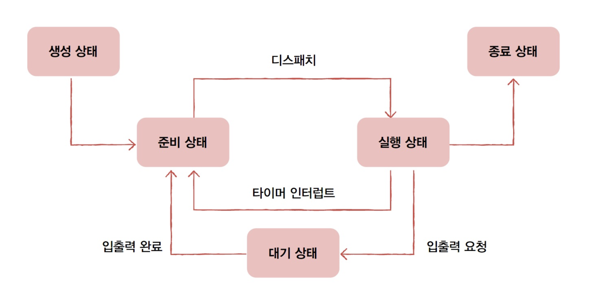

## 프로세스의 계층구조

프로세스는 실행 도중 시스템 호출을 통해 다른 프로세스를 생성할 수 있다.

부모 프로세스 : 새 프로세스를 만든 주체

자식 프로세스 : 새 프로세스

자식과 부모는 서로 다른 PID를 가지며, 일부 운영체제에서는 자식 프로세스의 PCB에 부모 프로세스의 PID인 PPID가 기록기도 함.

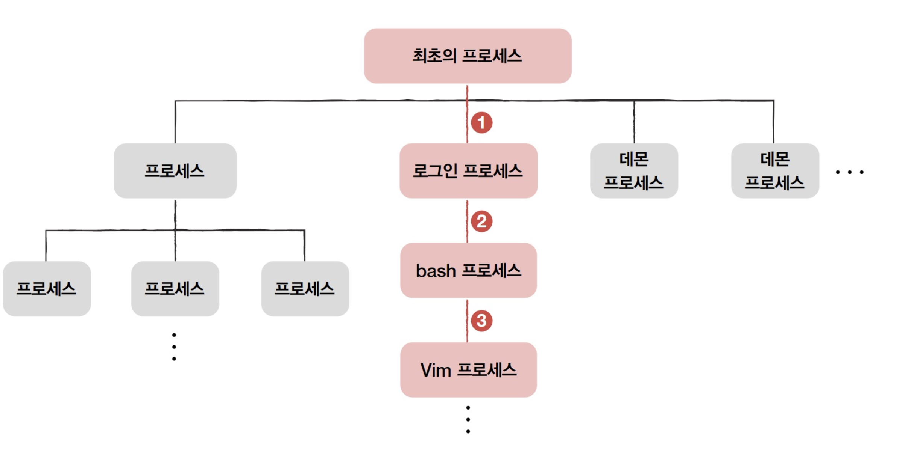

최초의 프로세스는 모든 프로세스 최상단에 있는 부모 프로세스이다.

- init : 유닉스
- 리눅스 : systemd
- macOS : launchd

항상 PID이 1이다

## 프로세스 생성 기법

> 부모 프로세스는 fork를 통해 자신의 복사본을 자식 프로세스로 생성해내고, 만들어진 복사본(자식 프로세스)은 exec를 통해 자신의 메모리 공간을 다른 프로그램으로 교체.

### fork

자기 자신 프로세스를 복사본을 만드는 시스템 호출. 메모리 내용, 열린 파일 목록 등이 자식 프로세스에 상속된다. 그렇다고 저장된 메모리 위치가 같지는 않음.

fork를 통해 복사본이 만들어진 뒤 자식 프로세스는 exec시스템 호출을 통해 새로운 프로그램으로 전환된다.

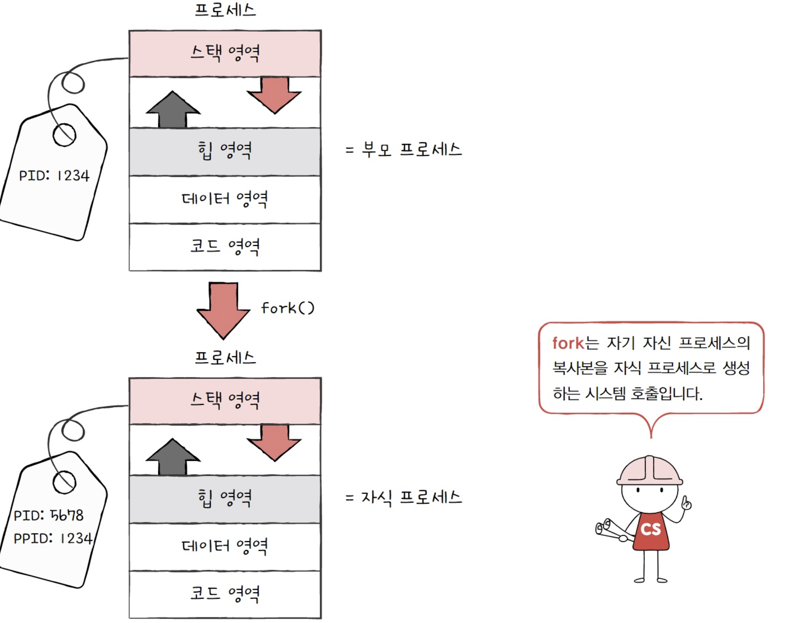

### exec

자신의 메모리 공간을 새로운 프로그램으로 덮어쓰는 시스템 호출. (새로운 프로그램 내용으로 전환하여 실행하는 시스템 호출)

코드 영역과 데이터 영역의 내용이 실행할 프로그램의 내용으로 바뀌고, 나머지는 초기화

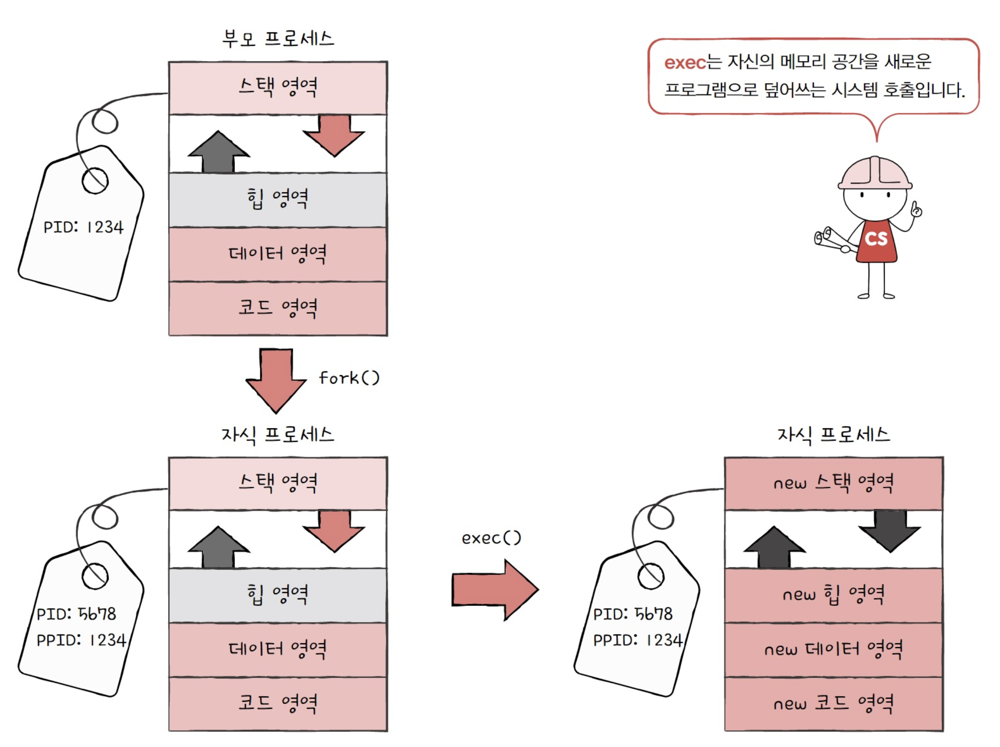

만약 exec를 사용하지 않는다면 해당 프로세스가 병렬로 실행될 듯?

# 스레드

> 프로세스를 구성하는 실행의 흐름 단위
> 프로세스는 여러 개의 스레드를 가질 수 있다.

단일 스레드 프로세스 : 실행 흐름 단위가 하나

스레드란

> 하나의 프로세스가 한 번에 여러 일을 동시에 처리할 수 있게 된 것.
> 프로세스를 구성하는 실행 단위

프로세스 내에서 각기 다른 스레드 id, 프로그램 카운터 값, 레지스터 값, 스택으로 구성된다.

스레드마다 각기 다른 코드를 실행할 수 있다.

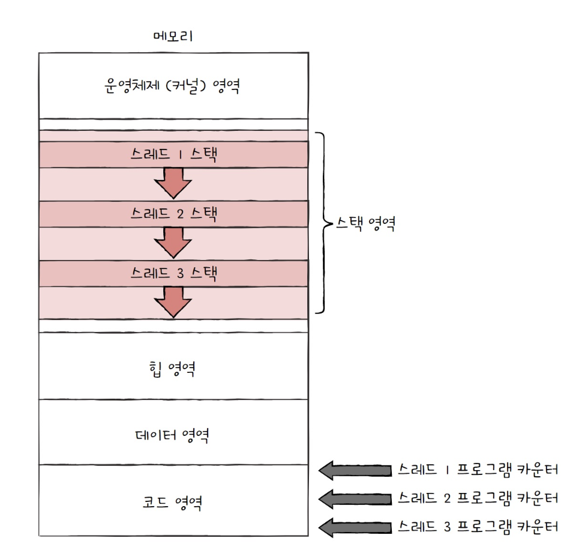

> 중요한 점
> 스레드들은 실행에 필요한 최소한의 정보만을 유지한 채 프로세스 자원을 공유하며 실행된다는 점이다.

## 멀티 프로세스와 멀티스레드

- 멀티프로세스 : 여러 프로세스를 동시에 실행하는 것
- 멀티스레드 : 여러 스레드로 프로세스를 동시에 실행하는 것

### 차이점

프로세스끼리는 자원 공유 x

스레드 끼리는 같은프로세스 내의 자원 공유

멀티프로세스인 경우에 fork하여 동일한 스레드를 여러개 만들면, 모든 자원이 복제되어 메모리에 적재됨.

그래서 이것은 낭비임

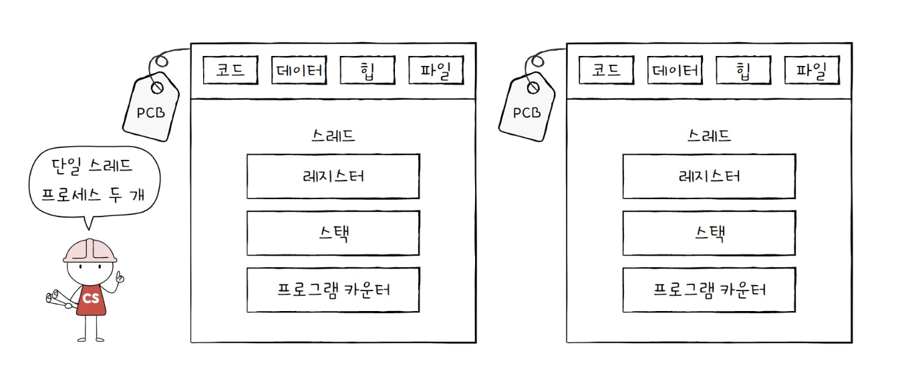

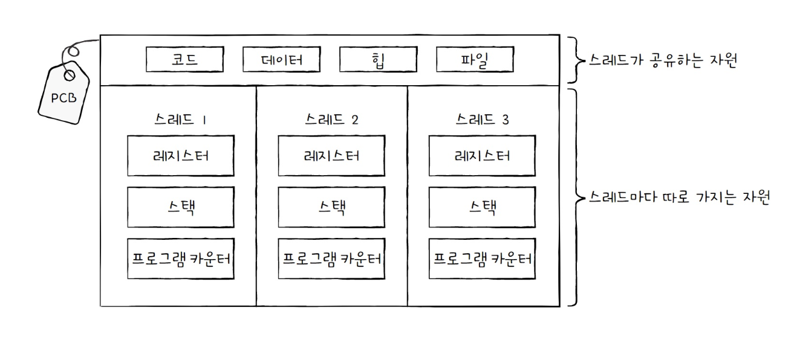

멀티 스레드 장점 : 여러 프로세스를 병행 실행보다 메모리 효율적. 협력과 통신에 유리함.

문제점 : 하나의 하나의 스레드에 문제가 생기면 프로세스 전체에 문제가 생길 수 있음. 모든 스레드는 프로세스의 자원을 공유하고, 하나의 스레드에 문제가 생기면 다른 스레드도 영향을 받기 때문

프로세스 간 통신도 가능하긴 함. 스레드보다 까다로울 뿐. 공유 메모리를 사용하면 됨
