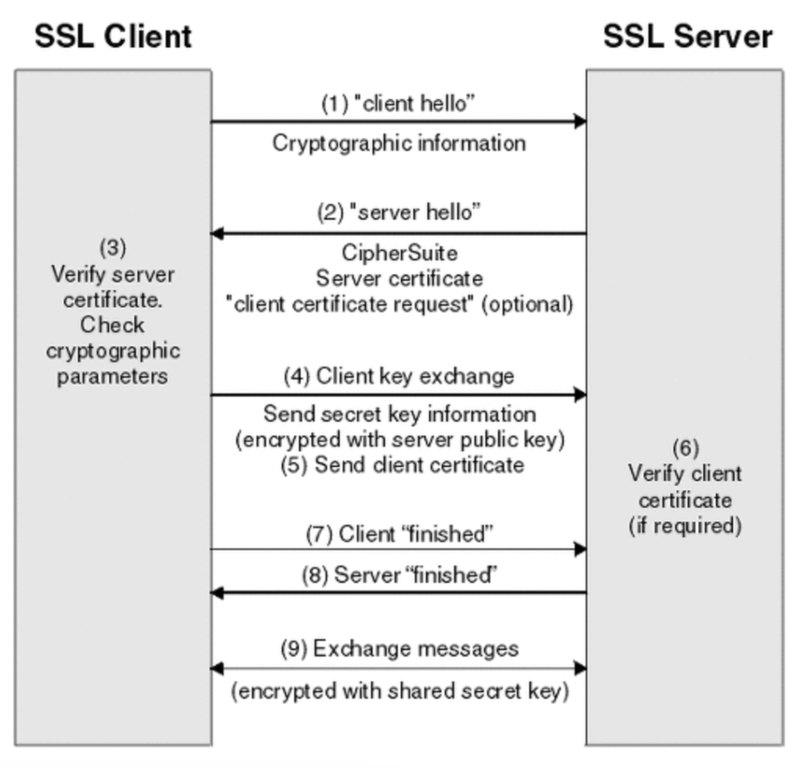

# HTTPS의 통신흐름

# 대칭키와 공개키(비대칭키)

### 대칭키

암호화와 복호화에 같은 암호키를 사용하는 알고리즘

- 동일한 키를 주고받으므로 매우 빠르다 (연산이 비교적 단순)
- 대칭키 전달과정에서 해킹 위험에 노출될 수 있다.

### 공개키

대칭키의 키 분배 문제를 해결하기 위해 고안. 자신이 가지고 있는 고유한 암호키(비밀키)로만 복호화할 수 있으며, 복호화할 수 있는 암호키(공개키)는 대중에 공개한다.  (private key : 복호화키)

- 공개키 암호화 방식
    - A가 웹 상에 공개된 B의 공개키로 평문을 암호화하여 B에게 보낸다.
    - B는 자신의 비밀키로 평문을 복호화한다. A의 공개키로 응답을 암호화해서 A에게 보낸다.
    - A는 자신의 비밀키로 응답문을 복호화한다.
- 한계
    - Confidentiality는 보장, but Integrity나 Authenticity는 보장하지 못한다.
        - Integrity : 데이터가 변조되지 않음.
        - Authenticity : 데이터의 출처 신뢰할 수 있음.
        - MAC이나 전자서명 방식으로 해결할 수 있다..
    - 대칭키에 비해 암호화 복호화가 매우 복잡하다.

### 대칭키와 공개키 암호화 방식을 혼합 → SSL 탄생의 시초

```java
1. A가 B의 공개키로 암호화 통신에 사용할 대칭키를 암호화하고 B에게 보낸다.
2. B는 암호문을 받고, 자신의 비밀키로 복호화하다.
3. B는 A로부터 얻은 대칭키로 A에게 보낼 평문을 암호화하여 A에게 보낸다.
4. A는 자신의 대칭키로 암호문을 복호화한다.
5. 앞으로 이 대칭키로 암호화를 통신한다.
```

- 대칭키를 주고받을 때에만 공개키 암호화 방식을 사용한 후, 이후 계속 대칭키 암호화 방식으로 통신

## TLS/SSL HandShake

(참고 : https://opentutorials.org/course/228/4894)

### 정의

HTTPS에서 클라이언트와 서버간 통신 전, SSL 인증서로 신뢰성 여부를 판단하기 위해 연결하는 방식

- 네스케이프에 의해 SSL이 발명되었고, 이후 표준화기구인 IETF에 의해 TLS라는 이름으로 변경

### SSL 인증서

클라이언트와 서버간의 통신을 제3자가 보증해주는 전자화된 문서. 

클라이언트가 서버에 접속한 직후 서버가 클라이언트에게 이 인증서 정보를 전달. 그리고 클라이언트는 이 인증서 정보가 신뢰할 수 있는지 인증한다.

`악수 → 전송 → 세션 종료` 순으로 통신을 한다.



### 진행 순서

### 1. 악수

1. 클라이언트 → 서버 : `메세지("client hello") + 암호화된 정보(버전, 암호알고리즘, 압축방식) (+ 세션 id)` 를 보낸다.
    1. 세션 id : 이미 SSL 핸드쉐이킹을 했다면 기존의 세션을 재활용. 이때 이 세션 연결에 활용할 식별자를 서버에 전송
2. 서버 → 클라이언트 : `세션 id + ca 공개 인증서 + 메세지("server hello")` 로 응답한다.
    1. ca 인증서 : 대칭키 생성 전, 클라이언트에서 handshake 과정 속 암호화에 사용할 공개키를 담고 있다.
    2. 클라이언트의 ca 인증서 확인 : 클라이언트에 내장된 CA의 공개키를 이용해 인증서를 복호화하고, 서버의 인증서가 CA에 의해 발급된 것인지 확인하기 위해 클라이언트에 내장된 CA 리스트를 확인. 리스트에 없다면 경고 메세지를 출력한다. ca인증서에 서버 공개키 정보가 있다. 
3. 클라이언트 → 서버 : ca인증서의 유효성 확인 후, 난수바이트(pre master secret, 이후 대칭키 생성시 활용)를 서버의 공개키로 암호화 (diffie-hellman 방법 기준.. 대칭키를 만들어서 암호화해서 보내기도 함)
    1. 2번의 단계에서 클라이언트 인증서도 함께 요구한 경우, `클라이언트의 인증서 + 클라이언트 개인키로 암호화된 바이트 문자열`도 함께 보낸다.
    2. 서버  : 클라이언트 인증서 확인 후, 난수 바이트(pre master secret)를 자신의 개인키로 복호화 후 대칭 마스터 키 생성에 활용
        - 서버와 클라이언트 모두 pre master secret값을 사용해 master secret(대칭키)으로 만든다.
4. 클라이언트 → 서버 : finished 메시지 + 지금까지 보낸 교환 내역들을 해싱 후 그 값을 대칭키(master secret)로 암호화해서 담음
5. 서버 → 클라이언트 : 교환 내역들을 해싱한 뒤 클라이언트에서 보내준 값과 일치하는 지 확인 후, 일치하면 서버도 finished 메시지를 새로 만든 대칭키로 암호화해서 보낸다. (핸드쉐이크 과정 종료)
    1. 클라이언트 : 해당 메시지를 대칭키로 복호화해 서로 통신이 가능한 신뢰받은 사용자임을 인지. 앞으로 클라이언트와 서버는 해당 대칭키로 데이터를 주고받음

### 2. 전송

1. master secret은 session key를 생성. 
2. session key 값을 서버와 클라이언트는 대칭키 방식으로 암호화한 후 주고받음. 
3. session key값을 서버와 클라이언트를 모두 공유받게 됨.

### 3. 세션 종료

데이터 전송이 끝났으면 SSL 통신이 끝났음을 서로에게 알려준다.

통신에서 사용한 대칭키인 세션키를 폐기한다.

## HTTPS 통신 흐름

1. 애플리케이션 서버를 만드는 기업은 HTTPS를 적용하기 위해 공개키와 개인키를 만든다.
2. 신뢰할 수 있는 CA 기업을 선택하고, 그 기업에게 내 공개키 관리를 부탁하며 계약을 한다.
    1. CA (Certificate Authority): 공개키를 저장해주는 신뢰성이 검증된 민간기업 
3. 계약 완료된 CA 기업은 해당 기업의 이름, A서버 공개키, 공개키 암호화 방법을 담은 인증서를 들고, 해당 인증서를 CA 기업의 개인키로 암호화해서 A서버에 제공한다.
4. A서버는 암호화된 인증서를 갖게 되었다. 이제 A서버는 A서버의 공개키로 암호화된 HTTPS 요청이 아닌 요청이 오면, 이 암호화된 인증서를 클라이언트에게 건내준다.
5. 클라이언트가 main.html 파일을 달라고 A서버에 요청했다고 가정하자. HTTPS 요청이 아니기 때문에 CA기업이 A서버의 정보를 CA기업의 개인키로 암호화한 인증서를 받게 된다.
    1. CA기업의 공개키는 브라우저가 이미 알고있다. (세계적으로 신뢰할 수 있는 기업으로 등록되어 있기 떄문에, 브라우저가 인증서를 탐색해 해독이 가능)
6. 브라우저는 해독한 뒤 A 서버의 공개키를 얻게 되었다.
7. 클라이언트가 A서버와 Handshaking 과정에서 주고받은 난수를 조합한후,  A서버의 공개키로 해당 값을 암호화하여 서버로 보냅니다. 
8. A서버는 암호화된 값를 자신의 개인키로 복호화하여 클라이언트와 동일한 대칭키를 획득합니다.
9. 이후 클라이언트 - 서버 사이의 통신을 주고받는 메세지는 이 대칭키를 암호화, 복호화를 진행합니다.