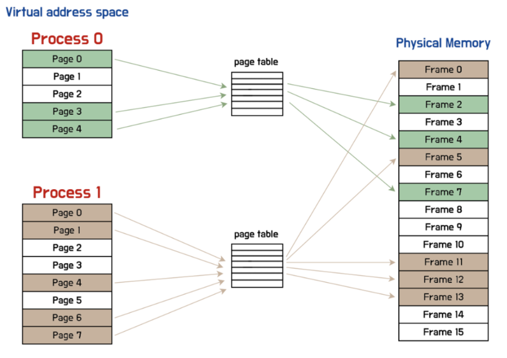
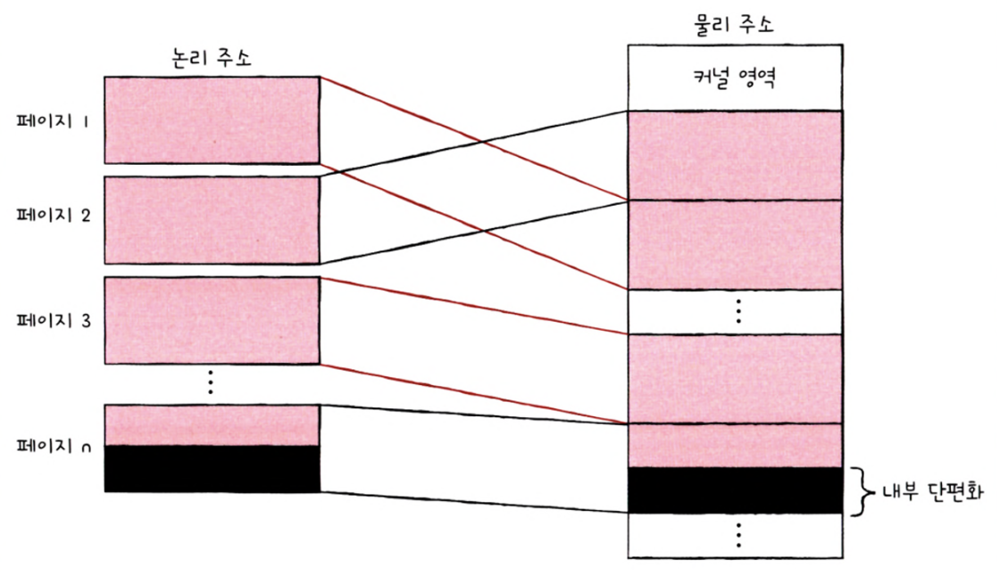
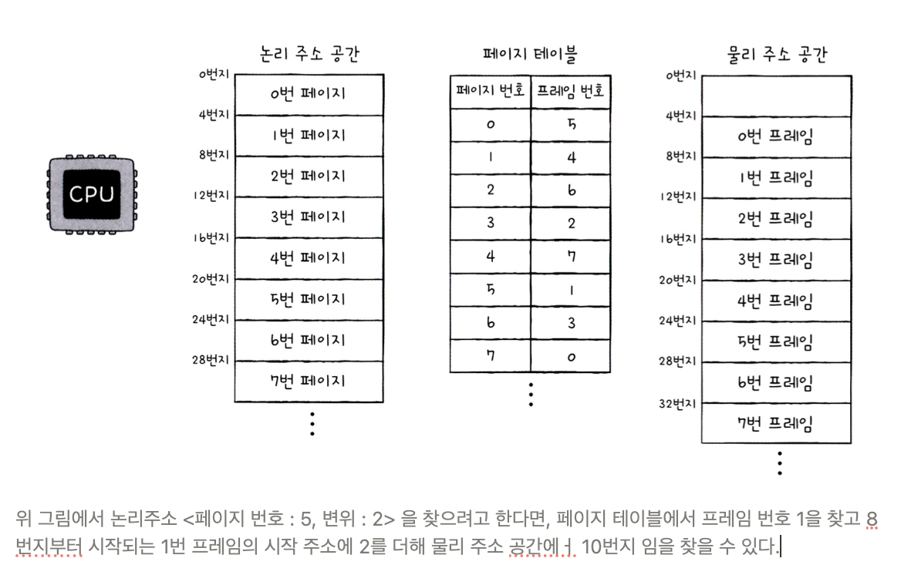
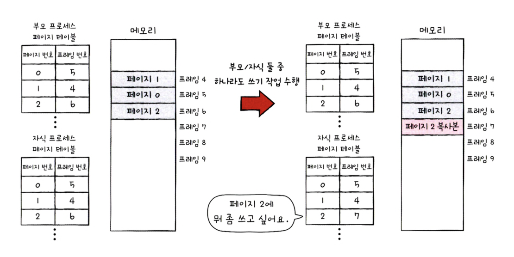
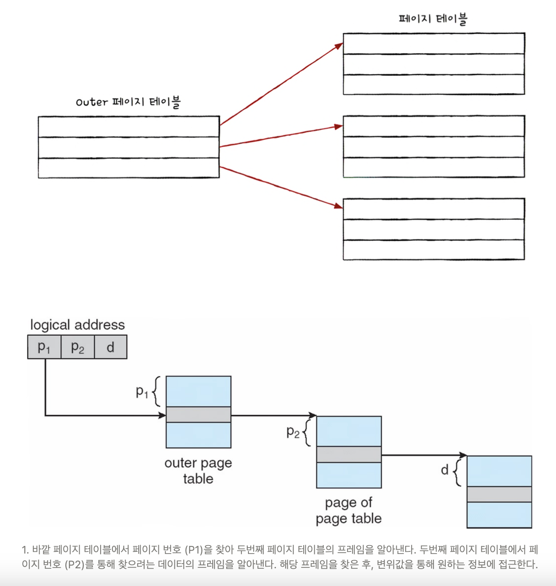

[참고용 노션](https://striped-beechnut-dfe.notion.site/3135d015010d46b9b30f719eebfa6d77?pvs=4)

# 가상 메모리
# 1. 연속 메모리 할당

연속 메모리 할당 방식 : 프로세스에 연속적인 메모리 공간을 할당하는 방식

→ 고려할 사항 : 스와핑, 메모리할당 방식

→ 잠재적 문제 : 외부 단편화 (→ sol : 메모리 압축, 페이징 기법)

## 스와핑

### 의미

메모리에 적재된 프로세스 중 현재 실행되지 않는 프로세스(대기 상태, 오랫동안 사용되지 않은 프로세스 등)를 보조기억 장치로 옮기고, 메모리 상의 빈 공간에 또 다른 프로세스를 적재하여 실행하는 방식

- 스왑 영역 : 메모리에서 프로세스가 스와핑을 위해 옮겨지는 보조기억장치의 일부 영역
- 스왑 아웃 : 메모리에 적재되었지만, 현재 실행되지 않는 프로세스가 보조기억 장치로 옮겨지는 것
- 스왑 인 : 스왑 영역에 있던 프로세스가 다시 메모리로 옮겨 오는 것

### 효과

프로세스가 요구하는 실제 메모리 공간의 크기가 실제 메모리 크기보다 크더라도 프로세스를 동시에 실행할 수 있다. 

## 메모리 할당

메모리 내의 빈공간이 여러개 있을 때 어디에 배치해야 할까?

### 최초 적합 (first fit)

메모리 내의 빈 공간을 순서대로 검색 중 적재할 수 있는 공간을 최초로 발견했을 때 바로 배치하는 방식

- 장점 : 검색 최소화 → 빠른 할당 가능

### 최적 적합(best fit)

모두 검색해본 후, 프로세스가 적재될 수 있는 가장 작은 공간에 프로세스를 배치하는 방식

### 최악 적합(worst fit)

모두 거맥해본 후, 프로세스가 적재될 수 있는 가장 큰 공간에 프로세스를 배치하는 방식

## 외부 단편화(External Fragmentation)

### 의미

프로세스들이 연속적으로 할당되는 환경에서 각 프로세스들이 실행되고 종료됨을 반복하여 메모리 사이 사이에 빈 공간이 생김. 그 공간의 합보다 작은 프로세스를 적재하려고 하더라도, 공간이 쪼개져있다면 적재할 수 없게 된다. → 메모리 낭비

### 해결책

### 1. 메모리 압축

여기저기 흩어진 빈 공간을 하나로 모아 큰 빈 공간을 만드는 방식. 

- 단점 :
    - 압축하는 동안 시스템은 하던 일을 중지해야 한다.
    - 메모리에 있는 내용을 옮기는 작업이 오버헤드 야기

### 2. 페이징 기법 (가상 메모리 기법)

# 2. 페이징을 통한 가상 메모리 관리

## 가상 메모리 (Virtual Memory)

### 의미

실행하고자 하는 프로그램 일부만 메모리에 적재하여 실제 물리 메모리 크기보다 더 큰 프로세스를 실행할 수 있게 하는 기술

### 사례

 페이징, 세그멘테이션

## 페이징이란

### 의미

메모리의 물리 주소 공간을 프레임 단위로 자르고, 프로세스의 논리 주소 공간을 페이지 단위로 자른 뒤 각 페이지를 프레임에 할당하는 가상 메모리 관리 기법

- 외부 단편화 해결 : 메모리와 프로세스를 일정한 단위로 자르고, 이를 메모리에 불연속적으로 할당할 수 있기 떄문

### 페이징에서의 스와핑

페이징에서도 스와핑을 사용한다.

- 페이지 아웃 : 페이징 시스템 스왑 아웃 (메모리에 적재될 필요 없는 페이지들은 보조기억장치로 스왑아웃)
- 페이지 인 : 페이징 시스템 스왑 인 (실행에 필요한 페이지들은 메모리로 스왑 인)

→ 물리 메모리보다 더 큰 프로세스를 실행할 수 있다.

## 페이지 테이블

### 의미

페이지 번호와 프레임 번호를 짝지어주어, 테이블의 페이지 번호를 통해 프레임 번호를 알 수 있다. 

- 물리 주소(프레임, 실제 메모리 주소)에는 불연속적으로 배치되더라도, 논리 주소(페이지, CPU가 바라보는 주소)에는 연속적으로 배치되도록 한다.
    
    
    

### 내부 단편화 (Internal Fragmentation)

페이지 크기를 같게 자르기 때문에 모든 프로세스가 정확히 페이지 크기에 딱 맞게 잘리지 않는다. 그로 인해 할당되지 않고 비어있는 메모리 공간이 존재할 수 있다.

- 페이징 기법은 외부 단편화는 해결하지만, 내부 단편화는 야기할 수 있다.
- 하나의 페이지 크기보다 작은 크기로 발생
- 페이지 크기 설정
    - 페이지 크기가 작을 경우, 페이지 테이블 크기 ⬆️ → 메모리 낭비 증가
    - 페이지 크기가 작을 경우, 내부 단편화의 크기  ⬇️ → 메모리 낭비 감소
    - 적절하게 설정해야 한다.
  

### CPU의 페이지 접근 방식

- **페이지 테이블**
    - 각 프로세스마다 페이지 테이블을 가지고 있고, 메모리에 적재되어 있다.
- **페이지 테이블 베이스 레지스터**(PTBR, Page Table Base Register)
    - CPU 내에서 각 프로세스의 페이지 테이블이 적재된 주소를 가리키고 있다.
    - PCB에 기록되었다가 문맥 교환 시 값이 변경된다.

→  **problem** : 메모리 접근이 두 번 필요 

PTBR을 이용해 페이지 테이블에 접근해 프레임을 알아내고(메모리 접근 1회), 해당 프레임 주소를 찾아간다.(메모리 접근 2회)

**Solution  : TLB** **(Translation Lookaside Buffer)**

페이지 테이블의 캐시메모리를 둔다. 최근 사용된 페이지 위주로 저장한다.

- TLB 히트 : 찾고자 하는 페이지 번호가 TLB에 있는 경우
    - 메모리에 접근할 필요 없이 바로 TLB에서 프레임을 알 수 있다.
    - 메모리 접근이 한번으로 줄어든다.
- TLB 미스 : 찾고자 하는 페이지 번호가 TLB에 없는 경우
    - 메모리에 페이지 번호를 찾기 위해 접근해야 한다.
    - 메모리 접근이 두 번 소요된다.

## 페이징에서의 주소 변환

### 논리주소의 구성 : 페이지 번호 + 변위

- 페이지 번호
    - 말 그대로 페이지 번호. 페이지 테이블을 통해 페이지 번호에 해당하는 프레임을 알 수 있다.
- 변위
    - 찾고자 하는 주소가 프레임의 시작 주소로부터 얼마나 떨어져있는지를 나타낸다.
    - 논리주소의 변위 값과 물리 주소의 변위 값은 같다.
        
        
        

## 페이지 테이블 엔트리 (PTE, Page Table Etntry)

### 의미

페이지 테이블의 각각의 행. 페이지 번호, 프레임 번호, 유효 비트, 보호 비트, 참조비트, 수정 비트 등이 기록된다.

### 유효 비트 (Valid Bit)

해당 페이지에 접근이 가능한지(메모리에 적재된 상태인지) 여부를 나타낸다.

- 표현 방식
    - 1
        - 페이지가 메모리에 적재되어 있다.
    - 0 :
        - 페이지가 보조 기억 장치에 있다.
        - **페이지 폴트**
            - 메모리에 적재되지 않은 페이지로 접근하려고 할 때 (유효 비트가 0일 떄) 발생
            - 처리 과정
                - CPU에 기존 작업 내용 백업
                - 페이지 폴트 처리 루틴 실행
                - 원하는 페이지를 메모리에 가져온 후 유효 비트를 1로 변경
                - 페이지 폴트 처리 후, CPU가 해당 페이지 접근

### 보호 비트 (Protection Bit)

해당 페이지가 읽고 쓰기가 가능한 페이지인지, 둘 중 하나만 가능한지 등을 나타낸다.

- 표현 방식 1
    - 1
        - 읽고 쓰기가 모두 가능
    - 0
        - 읽기만 가능
        - 코드 영역이 이에 해당하여 보호비트를 통해 보호
- 표현 방식 2
    - r
        - 읽기 권한을 나타낸다.
    - w
        - 쓰기 권한을 나타낸다.
    - x
        - 실행 권한을 나타낸다.

### 참조 비트 (Reference Bit)

CPU가 이 페이지에 접근한 적 있는지를 나타낸다.

- 표현 방식
    - 1
        - 적재 후 CPU가 읽거나 쓴 적 있는 페이지
    - 0
        - 적재 후 CPU가 접근한 적 없는 페이지

### 수정 비트 (Modified Bit, Dirty Bit)

해당 페이지에 데이터를 쓴 적이 있는지 없는지 수정 여부를 나타낸다

- 표현 방식
    - 1
        - 변경된 적 있는 페이지
    - 0
        - 변경된 적 없는 페이지
- 활용
    - 페이지가 메모리에서 사라질 때, 보조기억장치에 쓰기 작업을 해야하는지를 판단하기 위해 존재
    - 수정된 적 있다면, 페이지가 스왑 아웃될 때 변경된 값을 보조기억장치에 기록하는 작업이 추가된다.

## 페이징의 이점 - 쓰기 시 복사

cf . fork() 시스템콜 

- 부모 프로세스의 복사본이 자식 프로세스로서 만들어진다.
- 자식 프로세스의 메모리가 별도의 공간에 생성된다.
- 고유한 페이지와 고유한 프레임을 가짐.
- 프로세스 생성 시간을 늦추고 불필요한 메모리 낭비를 야기한다.

cf. vfork() 시스템콜

- 부모 프로세스와 자식 프로세스가 메모리를 공유한다.
- 자식 프로세스가 쓰기 작업을 할 경우 부모 프로세스에게 그대로 보여지기 때문에, 쓰기 작업을 할 떄 유의해야 한다.

쓰기 시 복사

- 부모 프로세스와 자식 프로세스의 페이지 테이블이 같은 프레임을 가리킨다.
- 읽기 작업만 한다면 이 상태가 그대로 유지된다.
- 부모나 자식 프로세스가 쓰기 작업을 한다면 해당 페이지가 별도의 공간으로 복제된다.
- 쓰기 시 복사를 통해 프로세스 생성 시간을 줄이고, 메모리 공간 절약도 가능하다.
    
    
    

## 계층적 페이징(hierarchical table, 다단계 페이지 테이블 기법 multilevel page table)

모든 페이지 테이블 엔트리를 메모리에 두는 것은 메모리 낭비. 계층적 페이징을 통해 모든 페이지 테이블 엔트리를 메모리에 항상 유지할 필요가 없게 되었다. 일부 테이블은 보조 기억 장치에 저장해도 된다.

- CPU와 가장 가까운 Outer 페이지 테이블은 항상 메모리에 유지해야 한다.
- 논리 주소의 구성 : 바깥 페이지 번호 + 안쪽 페이지 번호 + 변위
- 단점 : 페이지 폴트가 발생할 경우, 메모리 참조 횟수가 많아지므로 계층이 많다고 해서 반드시 좋은 것은 아니다.

